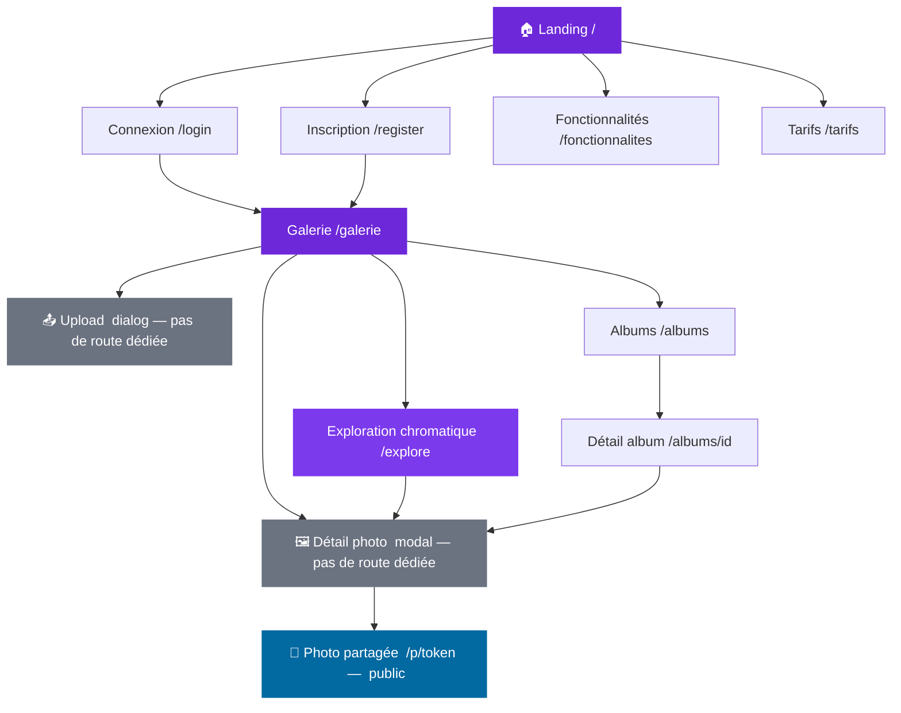

# Architecture des pages — PhotoApp

## Arborescence

---

## Pages existantes

### Pages publiques (sans authentification)
| Page | Route | Statut |
|------|--------|--------|
| Landing | `/` | ✅ Implémenté |
| Connexion | `/login` | ✅ Implémenté |
| Inscription | `/register` | ✅ Implémenté |
| Fonctionnalités | `/fonctionnalites` | ✅ Implémenté |
| Tarifs | `/tarifs` | ✅ Implémenté |
| Photo partagée (public) | `/p/[token]` | ✅ Implémenté |

### Pages authentifiées
| Page | Route | Statut |
|------|--------|--------|
| Galerie principale | `/galerie` | ✅ Implémenté |
| Exploration chromatique | `/explore` | ✅ Implémenté |
| Liste des albums | `/albums` | ✅ Implémenté |
| Détail d'un album | `/albums/[id]` | ✅ Implémenté |
| Dashboard admin | `/admin` | ✅ Implémenté |

### Composants sans route dédiée
| Élément | Implémentation | Note |
|---------|----------------|------|
| Détail photo | Modal overlay | Accessible depuis la galerie, l'exploration et les albums |
| Upload | Dialog | Intégré dans la page galerie (`/galerie`) |

---

## Notes

- La **galerie** (`/galerie`) est le hub central — toutes les pages app en partent.
- L'**exploration chromatique** (`/explore`) range les couleurs des photos dans un atlas fixe (palette OKLab) et présente un nuancier filtrable par album.
- Le **détail photo** et l'**upload** sont des composants (modal/dialog) intégrés dans les pages, sans route propre.
- Le **partage public** (`/p/[token]`) concerne les **photos** individuelles, pas les albums.
- Le groupe `/(public)` contient aussi `/mockups/*` (pages de développement, hors production).
