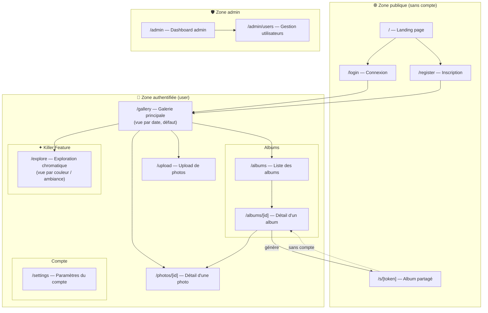

# Architecture des pages — PhotoApp

## Diagramme



---

## Pages à maquetter — priorités

### P1 — MVP (à faire en premier)
| Page | Route | Statut maquette |
|------|--------|-----------------|
| Landing | `/` | ✅ V4 / V5 en cours |
| Connexion | `/login` | ❌ À faire |
| Inscription | `/register` | ❌ À faire |
| Galerie principale | `/gallery` | ❌ À faire |
| Upload | `/upload` | ❌ À faire |
| Détail d'une photo | `/photos/[id]` | ❌ À faire |

### P2 — Core features
| Page | Route | Statut maquette |
|------|--------|-----------------|
| Exploration chromatique | `/explore` | ❌ À faire |
| Liste des albums | `/albums` | ❌ À faire |
| Détail d'un album | `/albums/[id]` | ❌ À faire |
| Album partagé (public) | `/s/[token]` | ❌ À faire |

### P3 — Secondaire
| Page | Route | Statut maquette |
|------|--------|-----------------|
| Paramètres du compte | `/settings` | ❌ À faire |
| Dashboard admin | `/admin` | ❌ À faire |
| Gestion utilisateurs | `/admin/users` | ❌ À faire |

---

## Notes

- La **galerie** (`/gallery`) est la page centrale de l'app — c'est depuis là qu'on accède à tout.
- L'**exploration chromatique** (`/explore`) est une vue alternative à la galerie, pas une page séparée dans la navigation principale — penser à un toggle ou un onglet dans la galerie.
- La page **album partagé** (`/s/[token]`) est publique mais ressemble visuellement à la page album authentifiée — une seule maquette peut couvrir les deux avec des variantes.
- Les pages **admin** peuvent partager un layout commun distinct du layout user.
```
