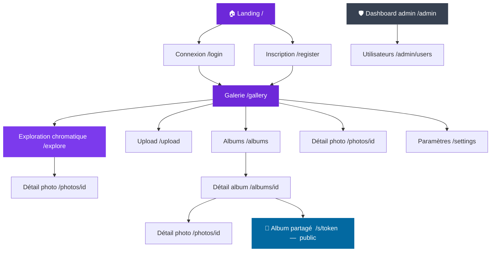

# Architecture des pages — PhotoApp

## Arborescence

---

## Pages à maquetter — priorités

### P1 — MVP
| Page | Route | Statut |
|------|--------|--------|
| Landing | `/` | ✅ V4 / V5 en cours |
| Connexion | `/login` | ❌ À faire |
| Inscription | `/register` | ❌ À faire |
| Galerie principale | `/gallery` | ❌ À faire |
| Upload | `/upload` | ❌ À faire |
| Détail d'une photo | `/photos/[id]` | ❌ À faire |

### P2 — Core features
| Page | Route | Statut |
|------|--------|--------|
| Exploration chromatique | `/explore` | ❌ À faire |
| Liste des albums | `/albums` | ❌ À faire |
| Détail d'un album | `/albums/[id]` | ❌ À faire |
| Album partagé (public) | `/s/[token]` | ❌ À faire |

### P3 — Secondaire
| Page | Route | Statut |
|------|--------|--------|
| Paramètres du compte | `/settings` | ❌ À faire |
| Dashboard admin | `/admin` | ❌ À faire |
| Gestion utilisateurs | `/admin/users` | ❌ À faire |

---

## Notes

- La **galerie** est le hub central — toutes les pages app en partent.
- L'**exploration chromatique** est un toggle dans la galerie, pas une entrée de nav séparée.
- **Détail photo** apparaît à plusieurs niveaux (galerie, exploration, album) — même page, contexte de retour différent.
- **Album partagé** (`/s/[token]`) est accessible sans compte — même UI que détail album en lecture seule.
