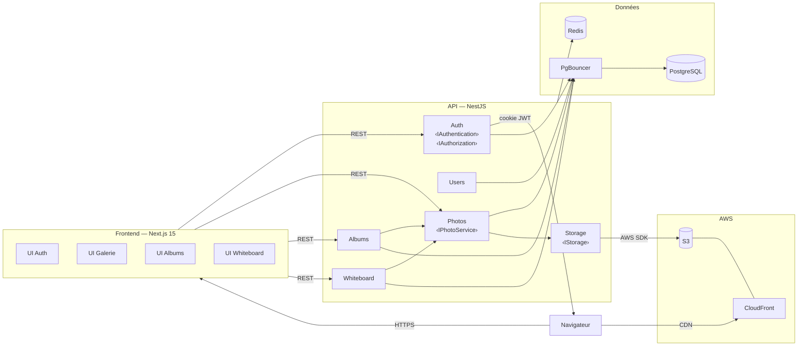
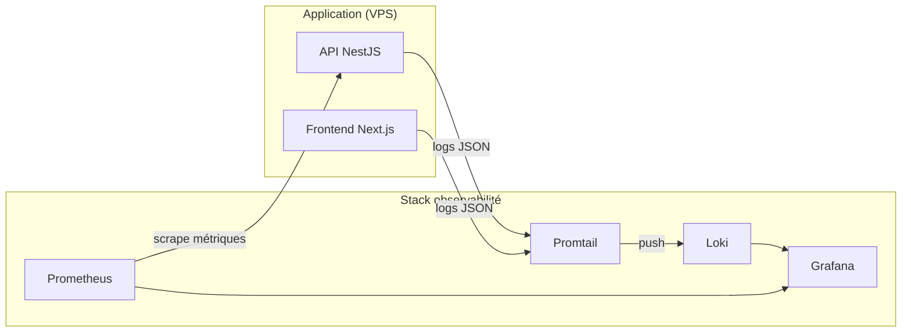
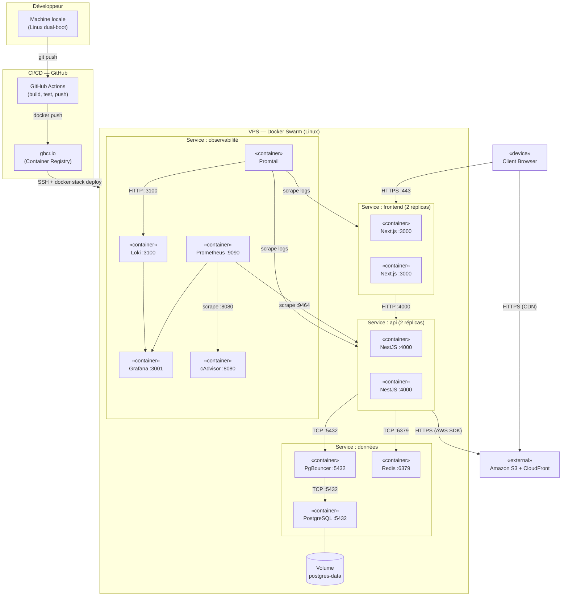

# Cartographie du Système d'Information

**Projet :** Fil Rouge — Plateforme de gestion de photos et albums
**Auteur :** Tony Mascate
**Date :** Janvier 2025

---

## Table des matières

1. [Diagramme de composants](#1-diagramme-de-composants)
2. [Diagramme de déploiement](#2-diagramme-de-déploiement)
3. [Analyse de risques](#3-analyse-de-risques)
4. [Accessibilité](#4-accessibilité)

---

## 1. Diagramme de composants

> **Objectif :** représenter le découpage fonctionnel du système — les grandes briques métier et leurs interactions.

**Diagramme 1 — Architecture applicative**

**Diagramme 2 — Observabilité**

### Interactions clés

| Flux                 | Source           | Destination     | Protocole        | Donnée                 |
| -------------------- | ---------------- | --------------- | ---------------- | ---------------------- |
| Requêtes utilisateur | Browser          | Next.js         | HTTPS :443       | Pages HTML / JSON      |
| Appels API           | Next.js          | NestJS          | HTTP :4000       | JSON (REST)            |
| Auth tokens          | NestJS           | Browser         | HTTP-only cookie | JWT                    |
| Données métier       | NestJS           | PgBouncer       | TCP :5432        | SQL                    |
| Connexions BDD       | PgBouncer        | PostgreSQL      | TCP :5432        | SQL (pooled)           |
| Cache                | NestJS           | Redis           | TCP :6379        | Clé-valeur             |
| Upload photos        | NestJS           | Amazon S3       | HTTPS (AWS SDK)  | Binaire                |
| Distribution photos  | CloudFront (CDN) | Browser         | HTTPS            | Binaire (mis en cache) |
| Logs                 | NestJS           | Promtail → Loki | HTTP             | JSON structuré         |
| Métriques            | Prometheus       | NestJS          | HTTP :9464       | Prometheus format      |

---

## 2. Diagramme de déploiement

> **Objectif :** représenter l'infrastructure physique — où tourne quoi et comment ça communique.

### Ports et protocoles

| Service            | Port exposé | Protocole                                   | Accessible depuis        |
| ------------------ | ----------- | ------------------------------------------- | ------------------------ |
| Next.js (frontend) | :3000       | HTTP (interne) / HTTPS :443 (reverse proxy) | Internet                 |
| NestJS (API)       | :4000       | HTTP                                        | Réseau interne Swarm     |
| PgBouncer          | :5432       | TCP                                         | Réseau interne Swarm     |
| PostgreSQL         | :5432       | TCP                                         | PgBouncer uniquement     |
| Redis              | :6379       | TCP                                         | Réseau interne Swarm     |
| Prometheus         | :9090       | HTTP                                        | Réseau interne Swarm     |
| Grafana            | :3001       | HTTP                                        | Administrateur (protégé) |
| Loki               | :3100       | HTTP                                        | Promtail uniquement      |

### Points critiques identifiés

| Point                  | Description                         | Risque                                              |
| ---------------------- | ----------------------------------- | --------------------------------------------------- |
| PostgreSQL single node | Pas de réplication lecture/écriture | SPOF — panne = indisponibilité BDD                  |
| Redis single node      | Pas de cluster Redis                | SPOF — panne = cache perdu                          |
| VPS unique             | Un seul serveur physique            | Indisponibilité totale si panne matérielle          |
| S3 / CloudFront (AWS)  | Service US soumis au Cloud Act      | Données photos exposables aux autorités américaines |

---

## 3. Analyse de risques

> **Méthode :** `RISQUE = Probabilité × Impact`
> Probabilité : 1 (faible) → 3 (élevée) · Impact : 1 (faible) → 3 (critique)
> Score : 🟢 1-2 · 🟡 3-4 · 🔴 6-9

### 3.1 Actifs critiques identifiés

| Actif           | Type                          | Données concernées                                            |
| --------------- | ----------------------------- | ------------------------------------------------------------- |
| PostgreSQL      | Base de données (nœud unique) | Comptes utilisateurs, métadonnées photos, albums, whiteboards |
| S3 / CloudFront | Stockage externe AWS          | Fichiers binaires photos                                      |
| Service Auth    | Service applicatif            | Mots de passe hachés, refresh tokens                          |
| Redis           | Cache                         | Données fréquentes                                            |
| VPS             | Infrastructure                | Ensemble du système                                           |

### 3.2 Matrice de risques

> Probabilité et impact évalués **avant mitigation** · Score résiduel **après mitigation**
> Échelle : 1 (faible) → 3 (élevé) · Score = Probabilité × Impact
> 🟢 1-2 · 🟡 3-4 · 🔴 6-9

| #   | Actif         | Menace                                      | Prob. brute | Impact | Score brut | Mitigation                                                                | Score résiduel |
| --- | ------------- | ------------------------------------------- | :---------: | :----: | :--------: | ------------------------------------------------------------------------- | :------------: |
| R1  | Service Auth  | Brute force sur login                       |      3      |   3    |  🔴 **9**  | Throttler (100 req/min), Argon2id, refresh token révocable                |    🟢 **2**    |
| R2  | PostgreSQL    | Panne / indisponibilité (nœud unique, SPOF) |      3      |   3    |  🔴 **9**  | Backups quotidiens, restart policy Swarm, monitoring + alerting Grafana   |    🔴 **6**    |
| R3  | Photos        | Accès non autorisé à des photos privées     |      2      |   3    |  🔴 **6**  | RBAC + Ownership guard (`resource.userId`), HTTPS, JWT HTTP-only cookie   |    🟢 **2**    |
| R4  | Tokens JWT    | Vol de token (XSS)                          |      2      |   3    |  🔴 **6**  | HTTP-only cookie (non accessible par JS), durée 15 min, HTTPS obligatoire |    🟢 **2**    |
| R5  | VPS           | Indisponibilité totale (panne matérielle)   |      2      |   3    |  🔴 **6**  | Rolling updates Swarm, snapshot VPS régulier, alerting Grafana            |    🟡 **3**    |
| R6  | Redis         | Indisponibilité (SPOF)                      |      2      |   2    |  🟡 **4**  | Restart policy Swarm, graceful degradation (cache miss → BDD)             |    🟢 **2**    |
| R7  | API NestJS    | Injection SQL                               |      1      |   3    |  🟡 **3**  | TypeORM (requêtes paramétrées), validation Zod en entrée                  |    🟢 **1**    |
| R8  | S3 / AWS      | Cloud Act — accès données par autorités US  |      1      |   2    |  🟢 **2**  | Région EU (eu-west-3 Paris), données perso non stockées sur S3            |    🟢 **1**    |
| R9  | Logs (Loki)   | Fuite de données sensibles dans les logs    |      1      |   2    |  🟢 **2**  | Pino sans données perso (pas de MDP, token ou PII en clair)               |    🟢 **1**    |
| R10 | Images Docker | Supply chain attack                         |      1      |   2    |  🟢 **2**  | Build en CI contrôlé, ghcr.io privé, GITHUB_TOKEN éphémère                |    🟢 **1**    |

### 3.3 Risques résiduels acceptés

Les risques suivants restent **partiellement ouverts** et sont acceptés dans le contexte du projet :

- **PostgreSQL single node (R2, score résiduel 🟡 4) :** La réplication primaire/secondaire dépasse la charge du projet solo. Mitigation retenue : backup quotidien automatisé + alerting immédiat sur panne.
- **VPS unique (R5, score résiduel 🟡 3) :** Un second VPS de failover n'est pas justifié économiquement à cette échelle. Le restart automatique Docker Swarm couvre les pannes applicatives.
- **Pas de WAF :** Le rate limiting applicatif (Throttler) et le pare-feu réseau du VPS constituent la protection en place.

---

## 4. Accessibilité

> **Référentiel :** WCAG 2.1 (niveau AA) / RGAA 4.1
> **Principes POUR :** Perceptible · Opérable · Understandable · Robuste

### 4.1 Choix techniques favorisant l'accessibilité

| Technologie                   | Bénéfice accessibilité                                                                                                                                       |
| ----------------------------- | ------------------------------------------------------------------------------------------------------------------------------------------------------------ |
| **Radix UI** (base shadcn/ui) | Implémente nativement tous les patterns ARIA : focus management, keyboard navigation, rôles ARIA corrects sur tous les composants (Dialog, Select, Tooltip…) |
| **Next.js (App Router, RSC)** | Génère du HTML sémantique côté serveur — favorable aux lecteurs d'écran et au référencement                                                                  |
| **Tailwind CSS v4**           | Utilitaires de contraste intégrés, respect des ratios WCAG via les classes de couleur                                                                        |
| **HTML sémantique**           | Landmarks HTML5 (`<header>`, `<nav>`, `<main>`, `<footer>`) utilisés dans tous les layouts                                                                   |

### 4.2 Critères WCAG appliqués

| Critère WCAG                       | Principe       | Application dans le projet                                                                      |
| ---------------------------------- | -------------- | ----------------------------------------------------------------------------------------------- |
| 1.1.1 — Contenu non textuel        | Perceptible    | Attribut `alt` descriptif sur toutes les vignettes photos ; `alt=""` sur les images décoratives |
| 1.4.3 — Contraste (minimum)        | Perceptible    | Ratio 4.5:1 minimum pour le texte normal, 3:1 pour le grand texte (vérifié via extensions web)  |
| 1.4.1 — Utilisation de la couleur  | Perceptible    | Statuts et informations non transmis uniquement par la couleur (icône + texte + couleur)        |
| 2.1.1 — Clavier                    | Opérable       | Navigation Tab/Entrée/Échap fonctionnelle sur tous les composants Radix UI                      |
| 2.4.3 — Ordre du focus             | Opérable       | Ordre de tabulation suit le flux de lecture visuel                                              |
| 2.4.7 — Focus visible              | Opérable       | Outline visible sur l'élément actif (non supprimé)                                              |
| 3.1.1 — Langue de la page          | Understandable | `lang="fr"` défini sur le `<html>`                                                              |
| 3.3.1 — Identification des erreurs | Understandable | Messages d'erreur Zod localisés et associés aux champs via `react-hook-form`                    |
| 4.1.2 — Nom, rôle, valeur          | Robuste        | Rôles ARIA natifs via Radix UI sur tous les composants interactifs                              |

### 4.3 Point de vigilance — Whiteboard (killer feature)

Le whiteboard interactif (React Flow) repose sur un rendu Canvas/SVG avec drag & drop. Ce type d'interface pose des défis d'accessibilité spécifiques :

| Limitation                                         | Impact                                    | Mitigation prévue                                                                                       |
| -------------------------------------------------- | ----------------------------------------- | ------------------------------------------------------------------------------------------------------- |
| Drag & drop non accessible au clavier par défaut   | Utilisateurs moteurs / navigation clavier | Prévoir des alternatives clavier : boutons "Déplacer nœud", sélection par Tab + touches directionnelles |
| Nœuds colorés comme seul identifiant               | Utilisateurs daltoniens                   | Ajouter un label textuel sur chaque nœud (nom de la couleur en texte)                                   |
| Zone canvas non vocalisée par les lecteurs d'écran | Utilisateurs malvoyants                   | Ajouter une description textuelle de la carte (liste des nœuds et photos associées) en dehors du canvas |

> **Note :** L'accessibilité complète du whiteboard représente une contrainte technique significative. Le niveau AA sur cette fonctionnalité spécifique sera atteint partiellement, avec les alternatives textuelles comme priorité.

### 4.4 Checklist de validation

- [ ] Tester la navigation clavier complète (Tab, Entrée, Échap) sans souris
- [ ] Vérifier les contrastes avec l'outil Wave ou Axe DevTools
- [ ] Valider les attributs `alt` sur toutes les images
- [ ] Tester avec un lecteur d'écran (NVDA / VoiceOver) sur les pages principales
- [ ] Vérifier que les messages d'erreur des formulaires sont annoncés par les lecteurs d'écran
- [ ] Contrôler la hiérarchie des titres (un seul `<h1>` par page, pas de saut de niveau)

---

_Document rédigé dans le cadre du Fil Rouge — certification Expert en Informatique et Systèmes d'Information, 3W Academy._
