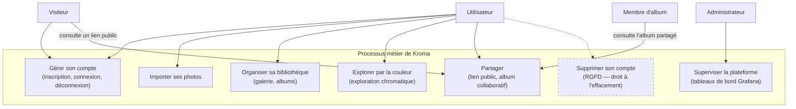
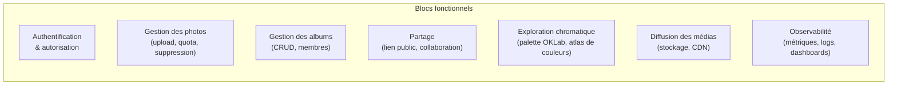
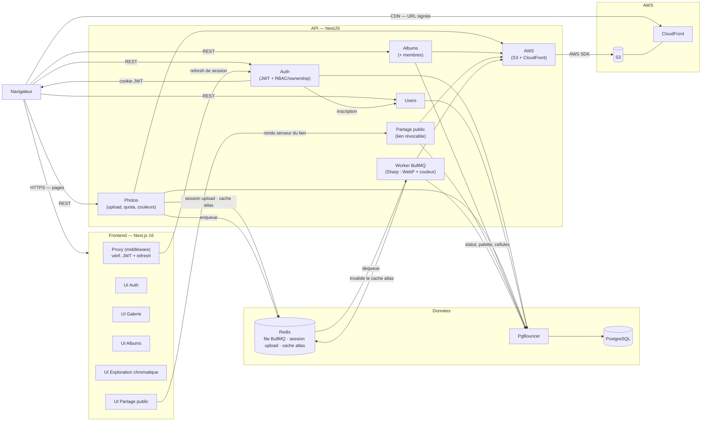
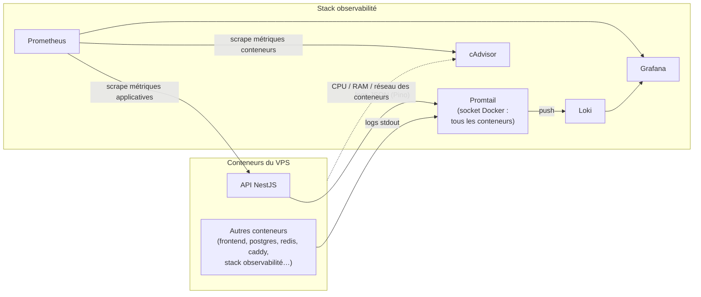
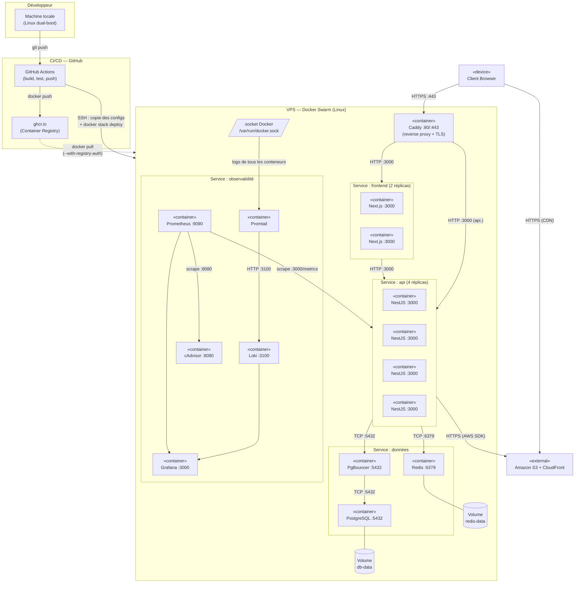

# Cartographie du Système d'Information

**Projet :** Fil Rouge — Plateforme de gestion de photos et albums
**Auteur :** Tony Mascate
**Date :** Janvier 2026

---

## Table des matières

La cartographie suit le découpage en **quatre niveaux** de l'urbanisation des systèmes d'information
(métier → fonctionnel → applicatif → infrastructure), du plus abstrait au plus concret, complété par
l'analyse de risques et l'accessibilité.

1. [Niveau métier](#1-niveau-métier)
2. [Niveau fonctionnel](#2-niveau-fonctionnel)
3. [Niveau applicatif — Diagramme de composants](#3-niveau-applicatif--diagramme-de-composants)
4. [Niveau infrastructure — Diagramme de déploiement](#4-niveau-infrastructure--diagramme-de-déploiement)
5. [Analyse de risques](#5-analyse-de-risques)
6. [Accessibilité](#6-accessibilité)

---

## 1. Niveau métier

> **Objectif :** représenter les **acteurs** et les **processus métier** du système, indépendamment de
> toute technologie — _qui_ fait _quoi_.

### 1.1 Acteurs

| Acteur             | Description                                                                                                                                                                                                              |
| ------------------ | ------------------------------------------------------------------------------------------------------------------------------------------------------------------------------------------------------------------------ |
| **Visiteur**       | Internaute non authentifié : peut créer un compte, se connecter, ou consulter une ressource partagée via un lien public.                                                                                                 |
| **Utilisateur**    | Compte authentifié : gère ses photos, ses albums, ses partages et explore sa bibliothèque par la couleur.                                                                                                                |
| **Membre d'album** | Utilisateur avec qui un album a été partagé (album collaboratif) : consulte l'album partagé.                                                                                                                             |
| **Administrateur** | Rôle `ADMIN` : supervision de la plateforme via les tableaux de bord Grafana. Dans l'API, le rôle ne protège aujourd'hui qu'un endpoint de contrôle — il n'ouvre **aucun** accès élargi aux ressources des utilisateurs. |

### 1.2 Processus métier

> **Lecture :** le trait plein correspond aux processus outillés dans la plateforme. Le trait
> **pointillé** marque un processus **cible, non implémenté à ce jour** : la suppression de compte
> (droit à l'effacement RGPD) n'expose aucune route côté API — seules les photos, albums et
> adhésions d'album sont supprimables. C'est l'écart de conformité principal identifié sur le projet.

Ces processus se déclinent en cas d'utilisation détaillés (diagrammes UML), disponibles dans
[`use_cases/`](use_cases/) : connexion/inscription, upload, détail image, gestion d'album, ajout d'image
à un album, suppression, partage par lien public.

---

## 2. Niveau fonctionnel

> **Objectif :** lister les **grandes fonctions** du système, regroupées en blocs cohérents, toujours
> indépendamment de la technologie.

| Bloc fonctionnel                | Processus métier servi    | Fonctions principales                                              |
| ------------------------------- | ------------------------- | ------------------------------------------------------------------ |
| Authentification & autorisation | Gérer son compte          | Inscription, connexion, déconnexion, rôles, sessions révocables    |
| Gestion des photos              | Importer ses photos       | Upload résilient, quota, statut de traitement, suppression         |
| Gestion des albums              | Organiser sa bibliothèque | Création, contenu, renommage, couverture, membres                  |
| Partage                         | Partager                  | Lien public révocable, albums collaboratifs                        |
| Exploration chromatique         | Explorer par la couleur   | Extraction de palette OKLab, classement en atlas chromatique fixe  |
| Diffusion des médias            | (transverse)              | Stockage objet, distribution CDN par URL signée                    |
| Observabilité                   | Superviser la plateforme  | Métriques, logs corrélés, tableaux de bord (alerting à configurer) |

> Les niveaux **applicatif** (section 3) et **infrastructure** (section 4) ci-dessous montrent _comment_
> ces blocs fonctionnels sont réalisés et déployés.

---

## 3. Niveau applicatif — Diagramme de composants

> **Objectif :** représenter les **composants logiciels** qui réalisent les blocs fonctionnels et leurs interactions.

**Diagramme 1 — Architecture applicative**

**Diagramme 2 — Observabilité**

### Interactions clés

| Flux                     | Source           | Destination     | Protocole                        | Donnée                          |
| ------------------------ | ---------------- | --------------- | -------------------------------- | ------------------------------- |
| Requêtes utilisateur     | Browser          | Next.js         | HTTPS :443                       | Pages HTML / RSC                |
| Appels API (client)      | Browser          | NestJS          | HTTPS :443 (sous-domaine `api.`) | JSON (REST) + cookies           |
| Appels API (serveur)     | Next.js          | NestJS          | HTTP :3000 (réseau Swarm)        | Refresh de session, lien public |
| Auth tokens              | NestJS           | Browser         | HTTP-only cookie                 | JWT                             |
| Données métier           | NestJS           | PgBouncer       | TCP :5432                        | SQL                             |
| Connexions BDD           | PgBouncer        | PostgreSQL      | TCP :5432                        | SQL (pooled)                    |
| File de traitement image | NestJS ↔ Worker  | Redis           | TCP :6379                        | Jobs BullMQ                     |
| Cache & sessions upload  | NestJS           | Redis           | TCP :6379                        | Clé-valeur (TTL)                |
| Upload photos            | NestJS           | Amazon S3       | HTTPS (AWS SDK)                  | Binaire                         |
| Distribution photos      | CloudFront (CDN) | Browser         | HTTPS                            | Binaire signé (mis en cache)    |
| Logs                     | NestJS           | Promtail → Loki | HTTP                             | JSON structuré                  |
| Métriques                | Prometheus       | NestJS          | HTTP :3000 `/metrics`            | Format Prometheus               |

---

## 4. Niveau infrastructure — Diagramme de déploiement

> **Objectif :** représenter l'infrastructure physique — où tourne quoi et comment ça communique.

### Ports et protocoles

| Service            | Port exposé | Protocole | Accessible depuis                           |
| ------------------ | ----------- | --------- | ------------------------------------------- |
| Caddy              | :80 / :443  | HTTP(S)   | Internet (seuls ports publiés par le stack) |
| Next.js (frontend) | :3000       | HTTP      | Caddy — `fil-rouge-plateforme.com`          |
| NestJS (API)       | :3000       | HTTP      | Caddy — `api.fil-rouge-plateforme.com`      |
| PgBouncer          | :5432       | TCP       | Réseau interne Swarm                        |
| PostgreSQL         | :5432       | TCP       | PgBouncer uniquement                        |
| Redis              | :6379       | TCP       | Réseau interne Swarm                        |
| cAdvisor           | :8080       | HTTP      | Prometheus uniquement                       |
| Prometheus         | :9090       | HTTP      | Caddy — `prom.fil-rouge-plateforme.com`     |
| Grafana            | :3000       | HTTP      | Caddy — `monitor.fil-rouge-plateforme.com`  |
| Loki               | :3100       | HTTP      | Promtail uniquement                         |

### Points critiques identifiés

| Point                  | Description                         | Risque                                              |
| ---------------------- | ----------------------------------- | --------------------------------------------------- |
| PostgreSQL single node | Pas de réplication lecture/écriture | SPOF — panne = indisponibilité BDD                  |
| Redis single node      | Pas de cluster Redis                | SPOF — panne = cache perdu                          |
| VPS unique             | Un seul serveur physique            | Indisponibilité totale si panne matérielle          |
| S3 / CloudFront (AWS)  | Service US soumis au Cloud Act      | Données photos exposables aux autorités américaines |

---

## 5. Analyse de risques

> **Méthode :** EBIOS Risk Manager (ANSSI) — version simplifiée (Ateliers 1, 2, 3 et 5)
> Probabilité : 1 (faible) → 3 (élevée) · Impact : 1 (faible) → 3 (critique)
> Score brut = Probabilité × Impact · Seuils : 1-2 🟢 · 3-4 🟡 · 6-9 🔴

---

### Atelier 1 — Cadrage et valeurs métier

#### Valeurs essentielles

| Valeur métier            | Description                                    | Critères de sécurité           |
| ------------------------ | ---------------------------------------------- | ------------------------------ |
| Photos des utilisateurs  | Fichiers binaires personnels stockés sur S3    | Confidentialité, Disponibilité |
| Comptes utilisateurs     | Email, mot de passe haché Argon2, profil       | Confidentialité, Intégrité     |
| Albums et partages       | Structure des albums, tokens de partage public | Intégrité, Disponibilité       |
| Disponibilité du service | Accès à la plateforme web                      | Disponibilité                  |

#### Biens supports

| Bien support                | Type                                        | Valeurs métier associées |
| --------------------------- | ------------------------------------------- | ------------------------ |
| PostgreSQL                  | Base de données relationnelle (nœud unique) | Toutes                   |
| Amazon S3                   | Stockage objet externe (AWS eu-west-3)      | Photos                   |
| API NestJS                  | Serveur d'application (4 réplicas Swarm)    | Toutes                   |
| Redis                       | Cache + verrous d'upload multipart          | Service, Auth            |
| VPS Docker Swarm            | Infrastructure d'hébergement (nœud unique)  | Toutes                   |
| Service Auth (JWT + Argon2) | Composant applicatif d'authentification     | Comptes                  |

---

### Atelier 2 — Sources de risque

| Source de risque             | Motivation                            | Capacité | Type de menace                           |
| ---------------------------- | ------------------------------------- | -------- | ---------------------------------------- |
| Hacker externe               | Vol de photos, revente de comptes     | Élevée   | Attaque ciblée ou opportuniste           |
| Bot automatisé               | Brute force, credential stuffing      | Élevée   | Attaque de masse non ciblée              |
| Erreur humaine               | Inattention, fatigue, manque de revue | Élevée   | Mauvaise configuration, fuite de secrets |
| Panne matérielle / réseau    | Usure, incident datacenter            | Moyenne  | Indisponibilité non intentionnelle       |
| Fournisseur défaillant (AWS) | Incident cloud, panne régionale       | Faible   | Indisponibilité externe                  |

---

### Atelier 3 — Scénarios de risque

> Probabilité et impact évalués **avant mitigation** · Score résiduel **après mitigation**
> Échelle : 1 (faible) → 3 (élevé) · Score = Probabilité × Impact

| #   | Actif         | Menace                                     | Source de risque       | Prob. | Impact | Score brut | Mitigation                                                                            | Score résiduel |
| --- | ------------- | ------------------------------------------ | ---------------------- | :---: | :----: | :--------: | ------------------------------------------------------------------------------------- | :------------: |
| R1  | Service Auth  | Brute force sur login                      | Bot automatisé         |   3   |   3    |   **9**    | Throttler (5 req/60s), Argon2id, refresh token JWT révocable en base                  |     **2**      |
| R2  | PostgreSQL    | Panne / indisponibilité (SPOF)             | Panne matérielle       |   3   |   3    |   **9**    | Backups quotidiens automatisés, restart policy Swarm, supervision Grafana (métriques) |     **6**      |
| R3  | Photos        | Accès non autorisé à des photos privées    | Hacker externe         |   2   |   3    |   **6**    | Ownership guard (`photo.userId`), JWT HTTP-only, URL S3 signées                       |     **2**      |
| R4  | Tokens JWT    | Vol de token via XSS                       | Hacker externe         |   2   |   3    |   **6**    | Cookies HTTP-only (inaccessibles par JS), access token 15 min, HTTPS                  |     **2**      |
| R5  | VPS           | Indisponibilité totale (panne matérielle)  | Panne matérielle       |   2   |   3    |   **6**    | Rolling updates Swarm, snapshot VPS régulier, supervision Grafana (métriques)         |     **3**      |
| R6  | Redis         | Indisponibilité (SPOF)                     | Panne matérielle       |   2   |   2    |   **4**    | Restart policy Swarm, graceful degradation (cache miss → DB)                          |     **2**      |
| R7  | API NestJS    | Injection SQL                              | Hacker externe         |   1   |   3    |   **3**    | TypeORM (requêtes paramétrées), validation Zod sur toutes les entrées                 |     **1**      |
| R8  | S3 / AWS      | Cloud Act — accès données par autorités US | Fournisseur défaillant |   1   |   2    |   **2**    | Région EU (eu-west-3 Paris), aucune donnée personnelle stockée sur S3                 |     **1**      |
| R9  | Logs (Loki)   | Fuite de données sensibles dans les logs   | Erreur humaine         |   1   |   2    |   **2**    | Pino sans MDP ni token ; email loggé uniquement à la connexion (audit intentionnel)   |     **1**      |
| R10 | Images Docker | Supply chain attack                        | Hacker externe         |   1   |   2    |   **2**    | Build CI contrôlé, ghcr.io privé, GITHUB_TOKEN éphémère                               |     **1**      |

#### Matrice de risques (avant mitigation)

Grille de criticité : chaque case correspond à un couple **Probabilité × Impact** ; les risques y
sont placés selon leur cotation brute. La couleur de la case indique la criticité (score = P × I :
🟢 1-2 · 🟡 3-4 · 🔴 6-9).

| Probabilité ↓ \ Impact → | Faible (1) | Moyen (2)                                                            | Critique (3)                                                             |
| ------------------------ | ---------- | -------------------------------------------------------------------- | ------------------------------------------------------------------------ |
| **Élevée (3)**           | 🟢 _(3)_ — | 🔴 _(6)_ —                                                           | 🔴 _(9)_ **R1** Brute force · **R2** Panne PostgreSQL                    |
| **Moyenne (2)**          | 🟢 _(2)_ — | 🟡 _(4)_ **R6** Redis SPOF                                           | 🔴 _(6)_ **R3** Accès photos · **R4** Vol token XSS · **R5** Indispo VPS |
| **Faible (1)**           | 🟢 _(1)_ — | 🟢 _(2)_ **R8** Cloud Act · **R9** Fuite logs · **R10** Supply chain | 🟡 _(3)_ **R7** Injection SQL                                            |

> Lecture : les risques **R1 à R5** (haut-droite) sont les plus critiques avant mitigation et
> concentrent l'effort de traitement (voir le tableau de traitement EBIOS ci-dessous). Après
> mitigation, leurs scores résiduels retombent en zone 🟢/🟡.

---

### Atelier 5 — Traitement du risque

| #   | Stratégie              | Actions concrètes                                                                                   | Responsable  | Délai         |
| --- | ---------------------- | --------------------------------------------------------------------------------------------------- | ------------ | ------------- |
| R1  | **RÉDUIRE**            | Throttler NestJS (5 req/60s sur `/auth/login`), Argon2id, rotation refresh token                    | Tony Mascate | ✅ Implémenté |
| R2  | **RÉDUIRE + ACCEPTER** | Backup PostgreSQL quotidien via workflow GitHub Actions, monitoring Grafana (alerting à configurer) | Tony Mascate | ✅ Implémenté |
| R3  | **RÉDUIRE**            | Ownership guard sur chaque ressource, URL S3 signées temporairement                                 | Tony Mascate | ✅ Implémenté |
| R4  | **RÉDUIRE**            | Cookies HTTP-only + Secure + SameSite=Lax, access token 15 min, HTTPS obligatoire                   | Tony Mascate | ✅ Implémenté |
| R5  | **RÉDUIRE + ACCEPTER** | Docker Swarm restart policy, snapshot VPS hebdomadaire, monitoring Grafana                          | Tony Mascate | ✅ Implémenté |
| R6  | **RÉDUIRE**            | Restart policy Swarm, dégradation gracieuse (cache miss → DB)                                       | Tony Mascate | ✅ Implémenté |
| R7  | **ÉVITER**             | TypeORM avec requêtes paramétrées, validation Zod sur toutes les entrées API                        | Tony Mascate | ✅ Implémenté |
| R8  | **TRANSFÉRER**         | AWS région eu-west-3 (Paris), aucune PII stockée sur S3 (binaires uniquement)                       | AWS / Tony   | ✅ Implémenté |
| R9  | **RÉDUIRE**            | Pino sans MDP ni token ; email loggé à la connexion uniquement (traçabilité sécurité)               | Tony Mascate | ✅ Implémenté |
| R10 | **RÉDUIRE**            | Pipeline CI GitHub Actions, registry privé ghcr.io, GITHUB_TOKEN éphémère                           | Tony Mascate | ✅ Implémenté |

#### Risques résiduels acceptés

- **R2 — PostgreSQL SPOF (score résiduel 6) :** La réplication primaire/secondaire dépasse la charge d'un projet solo. Mitigation retenue : backup quotidien automatisé + supervision Grafana (règle d'alerte à configurer). Risque accepté en connaissance de cause.
- **R5 — VPS unique (score résiduel 3) :** Un VPS de failover n'est pas justifié économiquement à cette échelle. Le restart automatique Docker Swarm couvre les pannes applicatives.
- **Pas de WAF :** Le rate limiting applicatif (Throttler NestJS) et le pare-feu réseau du VPS constituent la protection en place. Risque accepté.

---

## 6. Accessibilité

> **Référentiel :** WCAG 2.1 (niveau AA) / RGAA 4.1
> **Principes POUR :** Perceptible · Opérable · Understandable · Robuste

### 6.1 Choix techniques favorisant l'accessibilité

| Technologie                   | Bénéfice accessibilité                                                                                                                                       |
| ----------------------------- | ------------------------------------------------------------------------------------------------------------------------------------------------------------ |
| **Radix UI** (base shadcn/ui) | Implémente nativement tous les patterns ARIA : focus management, keyboard navigation, rôles ARIA corrects sur tous les composants (Dialog, Select, Tooltip…) |
| **Next.js (App Router, RSC)** | Génère du HTML sémantique côté serveur — favorable aux lecteurs d'écran et au référencement                                                                  |
| **Tailwind CSS v4**           | Utilitaires de contraste intégrés, respect des ratios WCAG via les classes de couleur                                                                        |
| **HTML sémantique**           | Landmarks HTML5 (`<header>`, `<nav>`, `<main>`, `<footer>`) utilisés dans tous les layouts                                                                   |

### 6.2 Critères WCAG appliqués

| Critère WCAG                       | Principe       | Application dans le projet                                                                      |
| ---------------------------------- | -------------- | ----------------------------------------------------------------------------------------------- |
| 1.1.1 — Contenu non textuel        | Perceptible    | Attribut `alt` descriptif sur toutes les vignettes photos ; `alt=""` sur les images décoratives |
| 1.4.3 — Contraste (minimum)        | Perceptible    | Ratio 4.5:1 minimum pour le texte normal, 3:1 pour le grand texte (vérifié via extensions web)  |
| 1.4.1 — Utilisation de la couleur  | Perceptible    | Statuts et informations non transmis uniquement par la couleur (icône + texte + couleur)        |
| 2.1.1 — Clavier                    | Opérable       | Navigation Tab/Entrée/Échap fonctionnelle sur tous les composants Radix UI                      |
| 2.4.3 — Ordre du focus             | Opérable       | Ordre de tabulation suit le flux de lecture visuel                                              |
| 2.4.7 — Focus visible              | Opérable       | Outline visible sur l'élément actif (non supprimé)                                              |
| 3.1.1 — Langue de la page          | Understandable | `lang="fr"` défini sur le `<html>`                                                              |
| 3.3.1 — Identification des erreurs | Understandable | Messages d'erreur Zod localisés et associés aux champs via `react-hook-form`                    |
| 4.1.2 — Nom, rôle, valeur          | Robuste        | Rôles ARIA natifs via Radix UI sur tous les composants interactifs                              |

### 6.3 Point de vigilance — Exploration chromatique (killer feature)

L'exploration chromatique repose sur un nuancier (atlas fixe de cases colorées, chaque case = une cellule de couleur). Ce type d'interface, fondé sur la couleur, pose des défis d'accessibilité spécifiques :

| Limitation                                    | Impact                                    | Mitigation                                                                                                                          |
| --------------------------------------------- | ----------------------------------------- | ----------------------------------------------------------------------------------------------------------------------------------- |
| Identification par la seule couleur           | Utilisateurs daltoniens                   | Nom de la teinte + nombre de photos exposés en infobulle et `aria-label` sur chaque case (en place) ; étiquette visible à compléter |
| Cases non vocalisées par les lecteurs d'écran | Utilisateurs malvoyants                   | `aria-label` « {nom de teinte} — N photos » sur chaque case ; alternative textuelle de la répartition à compléter                   |
| Navigation à la souris (clic sur une case)    | Utilisateurs moteurs / navigation clavier | Cases rendues comme `<button>` focalisables et activables au clavier (Tab + Entrée)                                                 |

> **Note :** L'accessibilité complète de l'exploration chromatique représente une contrainte significative (interface intrinsèquement visuelle). Le niveau AA sur cet écran sera atteint partiellement, avec les alternatives textuelles comme priorité.

### 6.4 Checklist de validation

- [ ] Tester la navigation clavier complète (Tab, Entrée, Échap) sans souris
- [ ] Vérifier les contrastes avec l'outil Wave ou Axe DevTools
- [ ] Valider les attributs `alt` sur toutes les images
- [ ] Tester avec un lecteur d'écran (NVDA / VoiceOver) sur les pages principales
- [ ] Vérifier que les messages d'erreur des formulaires sont annoncés par les lecteurs d'écran
- [ ] Contrôler la hiérarchie des titres (un seul `<h1>` par page, pas de saut de niveau)

---

_Document rédigé dans le cadre du Fil Rouge — certification Expert en Informatique et Systèmes d'Information, 3W Academy._
