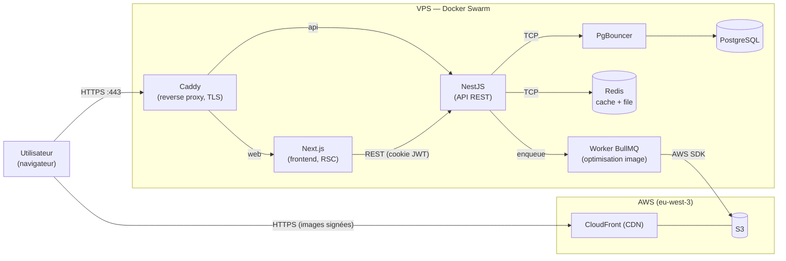
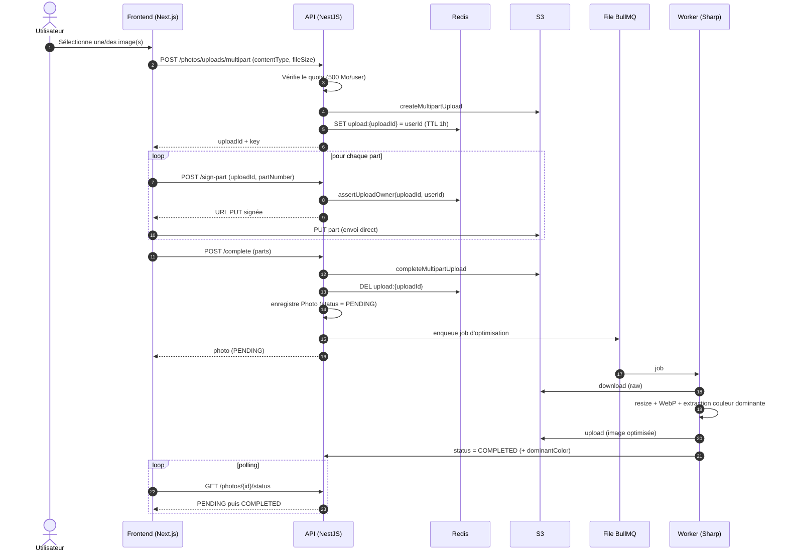
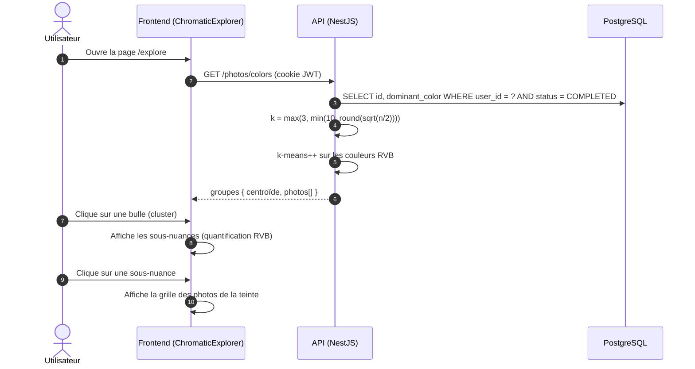
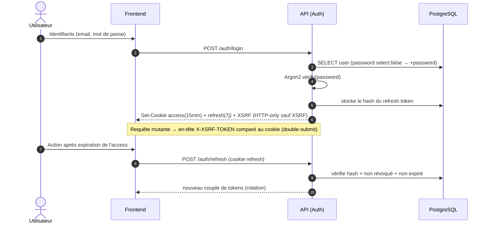

# Diagrammes de flux et de séquence

**Projet :** Fil Rouge — Plateforme de gestion de photos et albums (PhotoApp)
**Auteur :** Tony Mascate
**Date :** Juin 2026 _(mise à jour — aligné sur l'architecture livrée)_

---

> Ce document décrit les **flux dynamiques** du système. Pour les vues **statiques** (diagramme de
> composants, diagramme de déploiement, ports et protocoles), voir [`cartographie-si.md`](cartographie-si.md).
> Le reverse proxy utilisé est **Caddy** (TLS automatique via Let's Encrypt).

---

## 1. Flux nominal d'une requête authentifiée

**Points clés :** le frontend et l'API sont servis derrière un point d'entrée unique (Caddy) qui
centralise le TLS ; les images ne transitent jamais par l'API (diffusion directe via CloudFront avec
URL signée) ; le traitement d'image est déporté hors du cycle requête/réponse (worker BullMQ).

---

## 2. Diagramme de séquence — Upload d'une photo

> Upload multipart résilient vers S3 (URLs pré-signées) + traitement asynchrone. La session d'upload
> est attachée à l'utilisateur dans Redis (TTL 1 h) pour empêcher l'usurpation.

**Robustesse :** en cas d'échec d'enregistrement après assemblage, l'objet S3 est supprimé (rollback) ;
en cas d'échec du worker, le fichier brut est nettoyé et le statut passe à `FAILED`.

---

## 3. Diagramme de séquence — Exploration chromatique

> La couleur dominante est calculée **à l'upload** (section 2) ; l'exploration regroupe ensuite
> dynamiquement les couleurs par **k-means** côté serveur. C'est la fonctionnalité différenciante.

**Note :** aucune couleur n'est codée en dur côté frontend — les centroïdes k-means servent
directement de couleur d'affichage des bulles, dont la taille est proportionnelle au nombre de photos
du cluster. Le recalcul k-means à chaque requête est une limite connue (évolution : cache Redis).

---

## 4. Diagramme de séquence — Authentification (JWT + refresh)

---

_Document rédigé dans le cadre du Fil Rouge — certification Expert en Informatique et Systèmes d'Information, 3W Academy._
