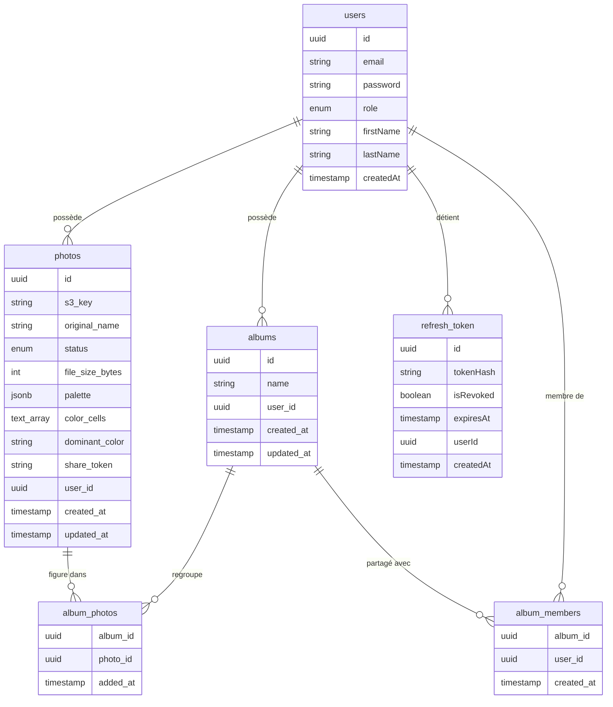
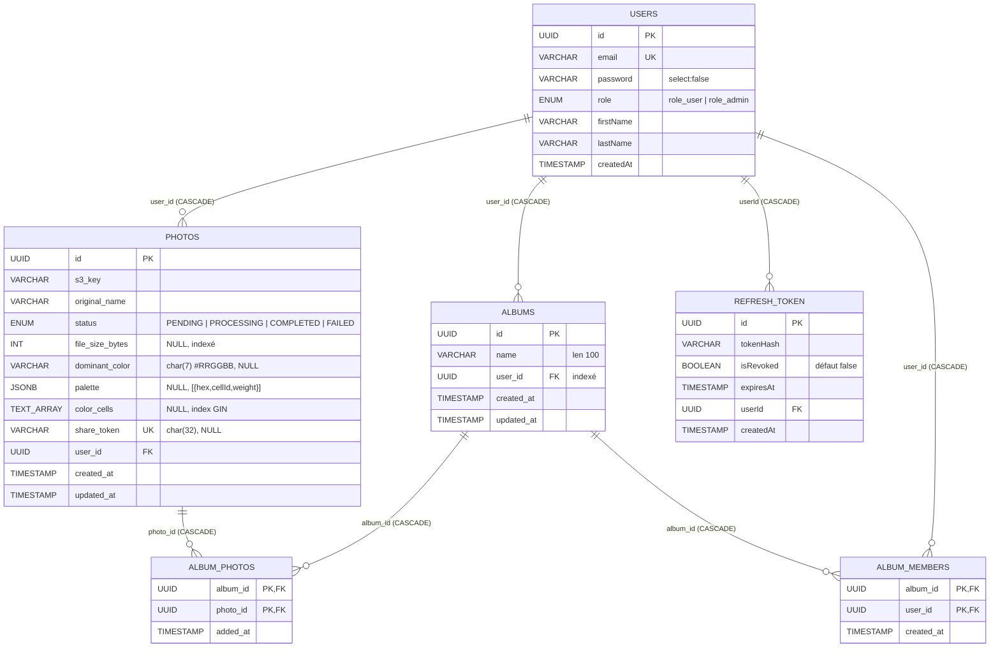
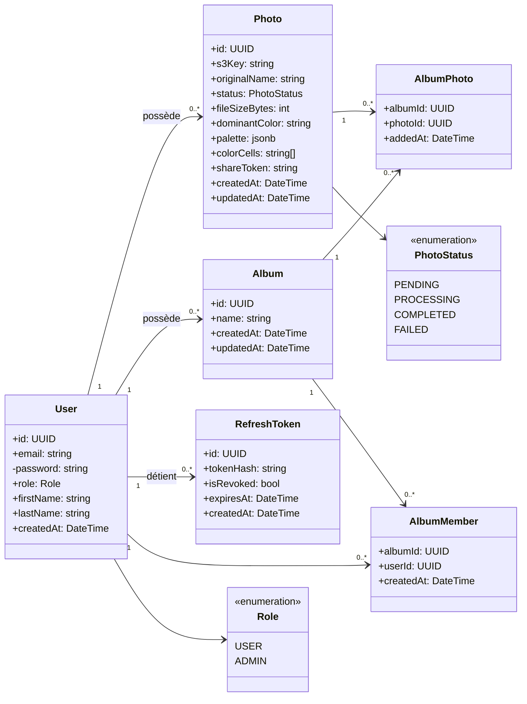

# Modélisation des données — MCD / MLD / MPD / Diagramme de classes

**Projet :** Fil Rouge — Plateforme de gestion de photos et albums (PhotoApp)
**Auteur :** Tony Mascate
**Date :** Juin 2026 _(mise à jour — modèle aligné sur l'implémentation livrée)_

---

## Avertissement — évolution du modèle

Ce document remplace la première modélisation produite en phase de conception. Le modèle a évolué
pendant le développement ; les diagrammes ci-dessous reflètent **le schéma réellement implémenté**
(entités TypeORM de `apps/api/src/**/entities/`), afin que la documentation reste cohérente avec le
code. Les principaux écarts avec la conception initiale sont :

| Conception initiale | Implémentation livrée |
| --- | --- |
| Table `LIEN` (token + expiration) rattachée à l'album | Pas de table dédiée. Le partage public est un **`share_token`** porté par la photo ; l'expiration n'est pas implémentée (« could have ») |
| `ALBUM(title, shared:boolean)` | `albums(name, …)` — le partage collaboratif passe par la table **`album_members`** |
| `PHOTO(title, type_mime)` | `photos(s3_key, original_name, status, file_size_bytes, dominant_color, **palette**, **color_cells**, share_token)` |
| Pas de rôle, pas de statut | Ajout du **`role`** (RBAC), du **`status`** de traitement et des colonnes couleur (**`palette`** + **`color_cells`** indexée GIN) pour l'**exploration chromatique** ; `dominant_color` conservée pour rétrocompatibilité |
| Pas de gestion de session | Ajout de la table **`refresh_token`** (révocation des jetons) |

---

## 1. MCD — Modèle Conceptuel de Données

> Vue entité-association présentée avec les **noms réels de tables et de colonnes** de la base
> (fidèle au code livré) ; les types physiques, clés et index sont détaillés au MPD (§3). Les tables
> de jointure `album_photos` et `album_members` sont modélisées en entités associatives, et le
> partage public d'une photo est porté par sa colonne `share_token` (pas d'entité dédiée).



**Lecture des cardinalités :**
- Un `users` possède de 0 à n `photos` et de 0 à n `albums` ; une photo / un album appartient à un et un seul utilisateur (FK `user_id`, `ON DELETE CASCADE`).
- L'appartenance d'une photo à un album passe par l'entité associative **`album_photos`** (clé composite `album_id` + `photo_id`) : une photo figure dans 0 à n albums, un album regroupe 0 à n photos. La colonne `added_at` date l'ajout.
- Le partage collaboratif passe par l'entité associative **`album_members`** (clé composite `album_id` + `user_id`) : un album est partagé avec 0 à n membres, un utilisateur est membre de 0 à n albums. La colonne `created_at` date l'accès.
- Un `users` détient de 0 à n `refresh_token` (sessions révocables) ; seule l'empreinte du jeton (`tokenHash`) est conservée, jamais sa valeur en clair.
- La colonne `palette` (3 à 5 couleurs pondérées, `jsonb`) et le tableau `color_cells` (`text[]`) portent l'exploration chromatique : une photo appartient à plusieurs couleurs. `dominant_color` est un **attribut dérivé** (couleur de poids maximal de la palette), conservé pour rétrocompatibilité.
- ⚠️ **Incohérence de nommage réelle** : `users` et `refresh_token` ont leurs colonnes en **camelCase** (`firstName`, `lastName`, `createdAt`, `tokenHash`, `isRevoked`, `expiresAt`, `userId`) — leurs entités TypeORM ne déclarent pas de `name:` explicite — alors que `photos`, `albums`, `album_photos` et `album_members` sont en **snake_case**. Le schéma reflète la base telle qu'elle est.

---

## 2. MLD — Modèle Logique de Données

> Passage au relationnel : les associations (1,n) deviennent des clés étrangères ; les associations
> (n,n) deviennent des tables de jointure. Clés primaires soulignées `__…__`, clés étrangères `#…`.

```
users (__id__, email, password, role, firstName, lastName, createdAt)

photos (__id__, s3_key, original_name, status, file_size_bytes, dominant_color,
        palette, color_cells, share_token, #user_id, created_at, updated_at)

albums (__id__, name, #user_id, created_at, updated_at)

album_photos (__#album_id, #photo_id__, added_at)

album_members (__#album_id, #user_id__, created_at)

refresh_token (__id__, tokenHash, isRevoked, expiresAt, #userId, createdAt)
```

**Contraintes notables :**
- `users.email` est **unique** ; `photos.share_token` est **unique** (et peut être nul).
- `album_photos` et `album_members` ont une **clé primaire composite** (deux colonnes), ce qui interdit nativement les doublons.
- Toutes les clés étrangères sont en **suppression cascade** (`ON DELETE CASCADE`) : supprimer un utilisateur efface l'ensemble de ses données (droit à l'oubli RGPD).

---

## 3. MPD — Modèle Physique de Données (PostgreSQL)

> Implémentation physique : noms de tables et de colonnes réels, types PostgreSQL, clés et index.



**Choix physiques :**
- **Identifiants UUID** générés en base : non devinables, utiles pour les accès par lien.
- **Types ENUM PostgreSQL** pour `role` (valeurs stockées `role_user` / `role_admin`) et `status` (`PENDING`, `PROCESSING`, `COMPLETED`, `FAILED`) — intégrité au niveau du SGBD.
- **Nommage des colonnes non uniforme** (reflété tel quel) : `photos`, `albums`, `album_photos`, `album_members` en `snake_case` ; `users` et `refresh_token` en `camelCase` (`firstName`, `lastName`, `createdAt`, `tokenHash`, `isRevoked`, `expiresAt`, `userId`), leurs entités ne fixant pas de `name:` explicite.
- **Index** sur `photos.file_size_bytes` (calcul du quota), `albums.user_id` et `album_members.user_id` (listes par utilisateur).
- **Index GIN** sur `photos.color_cells` (colonne tableau) : adapté à la recherche d'appartenance d'une valeur dans un tableau, il prépare la montée en charge de l'exploration chromatique (« quelles photos contiennent la cellule X ? »).
- **Colonnes couleur** (`palette` en `jsonb`, `color_cells` en `text[]`) : une photo porte une palette de 3–5 couleurs pondérées et appartient donc à **plusieurs** cellules d'atlas — d'où le tableau plutôt qu'une simple colonne scalaire.
- Les tables de liaison `album_photos` / `album_members` portent leur date (`added_at` / `created_at`) pour l'historique et le tri.

---

## 4. Diagramme de classes (modèle persistant)

> Les classes ci-dessous correspondent aux entités TypeORM. Le comportement métier (validation,
> orchestration, calcul du quota, exploration chromatique…) est porté par la couche **Service**, et
> les requêtes complexes par la couche **Repository** ; ce diagramme se concentre sur le modèle de
> données et ses relations.



**Notes de conception :**
- `Photo.palette` (jsonb, 3–5 couleurs OKLab pondérées) et `Photo.colorCells` (tableau indexé en GIN des cellules d'atlas couvertes) alimentent l'**exploration chromatique** ; une photo peut appartenir à plusieurs couleurs. `dominantColor` (= couleur de poids max) est conservé pour rétrocompatibilité.
- `Photo.shareToken` matérialise le **partage public** d'une photo (jeton révocable, accès sans compte).
- `AlbumMember` matérialise les **albums collaboratifs** (partage d'un album avec d'autres comptes).
- `RefreshToken.isRevoked` + `tokenHash` permettent la **révocation** explicite d'une session.

---

_Document rédigé dans le cadre du Fil Rouge — certification Expert en Informatique et Systèmes d'Information, 3W Academy._
