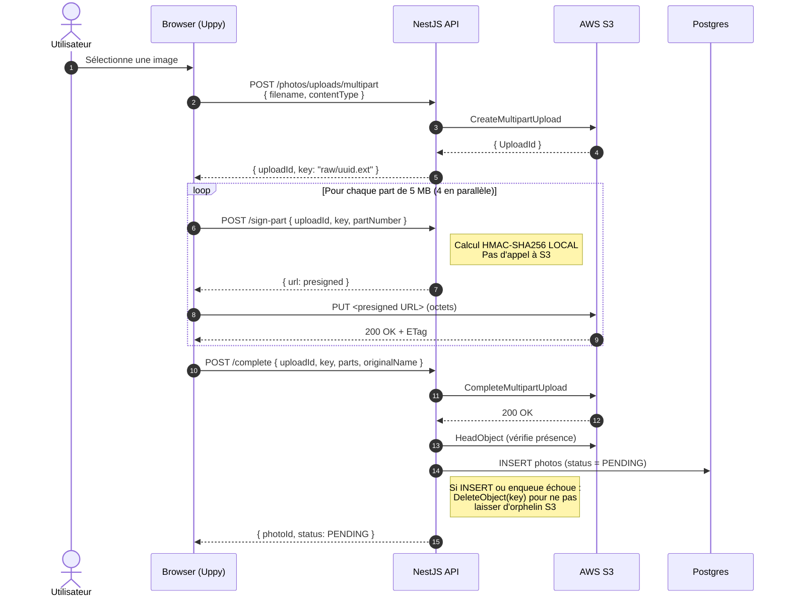
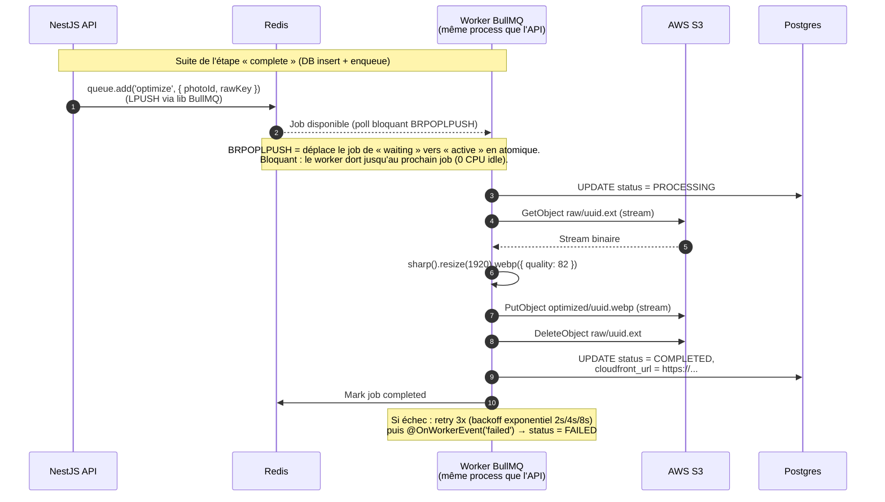
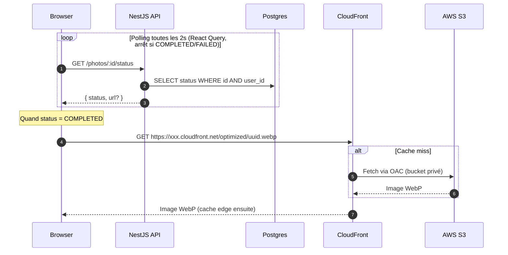

# Pipeline d'upload photos — Note de soutenance

## 1. Contexte et besoin

La plateforme permet aux utilisateurs d'uploader des photos. Le besoin impose plusieurs contraintes :

- **Gros fichiers** (jusqu'à 50 MB) → un upload HTTP classique bloquerait le serveur Node.js plusieurs secondes par requête
- **Optimisation obligatoire** (taille, format WebP) → économie de bande passante côté client final et de stockage côté infra
- **Expérience utilisateur** : barre de progression, reprise en cas de coupure, upload parallèle de plusieurs fichiers
- **Sécurité** : seul le propriétaire peut accéder à sa photo

## 2. Architecture retenue

### 2.1 Diagramme 1 — Phase upload (synchrone, côté utilisateur)



### 2.2 Diagramme 2 — Phase traitement (asynchrone, côté worker)



### 2.3 Diagramme 3 — Affichage (polling + CDN)



### 2.4 Flux en une phrase

Le navigateur upload directement vers S3 via des URLs présignées fournies par l'API, puis un worker asynchrone optimise l'image avant de la publier via CloudFront. **L'API ne transporte jamais les octets des images**, elle ne fait que signer des droits d'accès temporaires et orchestrer les métadonnées.

### 2.5 Note sur BullMQ

`BullMQ` n'est **pas un service**, c'est une **librairie Node.js** qui vit dans le même process que l'API. Elle utilise Redis comme stockage de listes (`LPUSH`/`BRPOPLPUSH`) pour coordonner producteur et consommateur. Dans l'archi actuelle :

- Le « producteur » est `PhotoService.registerUpload` → il appelle `queue.add(...)` qui pousse dans Redis
- Le « consommateur » est `PhotoProcessor` (décoré `@Processor('image-queue')`) → il boucle en permanence sur Redis pour récupérer les jobs

Les deux tournent dans le **même binaire Node** pour l'instant. Pour scaler, on pourrait déporter le `PhotoProcessor` dans un second process/machine sans changer une ligne de code — c'est tout l'intérêt de passer par Redis comme bus.

## 3. Les presigned URLs expliquées en détail

### 3.1 Anatomie d'une presigned URL

Une presigned URL S3 ressemble à ça :

```
https://fil-rouge-bucket-s3.s3.eu-west-3.amazonaws.com/raw/abc.jpg
  ?X-Amz-Algorithm=AWS4-HMAC-SHA256
  &X-Amz-Credential=AKIAXXXXX/20260420/eu-west-3/s3/aws4_request
  &X-Amz-Date=20260420T151234Z
  &X-Amz-Expires=900
  &X-Amz-SignedHeaders=host
  &partNumber=1&uploadId=xxx
  &X-Amz-Signature=7f9a3c...        ← la signature
```

### 3.2 Qu'est-ce que la signature ?

C'est un **HMAC-SHA256** (hash cryptographique à clé secrète) calculé sur une représentation canonique de la requête :

```
signature = HMAC-SHA256(
  clé     = dérivée de AWS_SECRET_ACCESS_KEY,
  message = "PUT\n/raw/abc.jpg\n<query-params>\nhost\n<date>\n..."
)
```

Le message signé contient :

- La **méthode HTTP** (`PUT`, `GET`, etc.)
- Le **chemin exact** (`/raw/abc.jpg`)
- Les **query params** (`partNumber`, `uploadId`, `X-Amz-Date`, `X-Amz-Expires`…)
- Le **host** S3
- La **date** de signature
- Le **temps d'expiration**

### 3.3 Pourquoi c'est sûr

1. **Seul NestJS peut fabriquer la signature** : elle nécessite `AWS_SECRET_ACCESS_KEY`, qui n'est jamais envoyé au navigateur.
2. **Toute modification invalide la signature** : si un attaquant change `partNumber=1` en `partNumber=2`, ou remplace le chemin par `/raw/victim.jpg`, S3 recalcule l'HMAC et détecte la divergence → `403 SignatureDoesNotMatch`.
3. **Expiration dans le message signé** : la date est embarquée, S3 refuse même une signature valide cryptographiquement si le délai (`X-Amz-Expires=900` → 15 min) est dépassé.
4. **Scope strict** : une URL = une seule opération (`PUT` sur `/raw/abc.jpg` avec `partNumber=1`). Pas un `GET`, pas un `DELETE`, pas un autre fichier.

### 3.4 Pourquoi HMAC et pas un token random

Un token random nécessiterait de stocker côté S3 « ce token autorise telle opération sur tel path jusqu'à telle heure » → base de données supplémentaire, latence en plus.

Avec HMAC, **aucun stockage côté S3** n'est nécessaire : la clé secrète + le message déterminent mathématiquement la signature. S3 peut valider des milliards d'URLs par seconde en **stateless**, juste en refaisant le calcul.

### 3.5 Analogie

Une presigned URL = un **chèque signé** avec montant fixe, destinataire fixe, date de validité.

- Le papier circule librement (URL dans le browser)
- Seul ton stylo (AWS secret) peut apposer ta signature valide
- La banque (S3) vérifie la signature contre ta signature de référence
- Rature un chiffre → signature invalide → rejet

## 4. Choix techniques justifiés

### 4.1 Upload multipart S3 avec presigned URLs

**Alternative écartée :** upload direct vers l'API qui re-forwarde vers S3.

**Pourquoi multipart + presigned :**

- L'API ne transporte **jamais** les octets de l'image → pas de saturation CPU/RAM/bande passante sur NestJS
- **Reprise automatique** : si une part échoue, Uppy ne retente que cette part (pas tout le fichier)
- **Parallélisme** : 4 parts uploadées en parallèle (option `limit: 4` d'Uppy) → 4x plus rapide
- **Sécurité** : chaque URL présignée expire en 15 min et n'autorise qu'**une seule opération** (PUT d'une part précise)

### 4.2 Pas de Companion (serveur Uppy officiel)

Companion est un reverse-proxy Node fourni par Uppy qui gère les presigned URLs. Je l'ai retiré du projet :

- C'est un service supplémentaire à déployer, monitorer, mettre à jour
- Il doit partager les credentials AWS → duplication du secret
- NestJS fait exactement la même chose en ~80 lignes (cf. [aws.service.ts](../../apps/api/src/aws/aws.service.ts))
- Un service de moins = surface d'attaque réduite, observabilité unifiée (tous les logs passent par pino dans l'API)

### 4.3 CloudFront + OAC (Origin Access Control)

Le bucket S3 est **privé** (pas de `public-read`). CloudFront signe les requêtes vers S3 avec OAC → seul CloudFront peut lire le bucket.

- Les photos sont servies via un **domaine unique maîtrisé** (cache, métrologie, possibilité de basculer d'origine sans changer les URLs)
- Le bucket ne peut pas être listé/exfiltré par quelqu'un qui devinerait un nom de fichier
- Performance : CDN avec edge locations monde entier

### 4.4 BullMQ + Sharp pour l'optimisation

**Pourquoi asynchrone :**

- Sharp consomme beaucoup de CPU pour une image haute résolution (~500ms à 2s). Faire ça dans la requête HTTP bloquerait le worker Node.
- En asynchrone : l'user reçoit immédiatement un `photoId` avec status `PENDING`, le front poll `/status` toutes les 2s.

**Pourquoi BullMQ (pas une simple Promise lancée en fire-and-forget) :**

- **Retry automatique** (3 tentatives avec backoff exponentiel) en cas d'échec transient (S3 timeout, OOM Sharp)
- **Persistance** : si l'API redémarre, les jobs en attente sont repris
- **Observabilité** : dashboard potentiel (Bull Board), events `completed`/`failed` hookables pour logs/metrics
- **Scalabilité horizontale** : on peut faire tourner N workers sur des machines dédiées

**Pourquoi Sharp :**

- Wrapper autour de libvips, la lib C la plus rapide du marché pour le redim/conversion d'images
- Support natif WebP (meilleure compression que JPEG pour la même qualité visuelle)
- Streaming API → on lit depuis S3, on traite, on écrit vers S3 sans charger l'image entière en RAM

### 4.5 Key S3 générée côté serveur

La key S3 (`raw/${uuid}${ext}`) est générée par l'API, pas par le client. Raison : empêcher un user d'injecter un chemin arbitraire (`../`, `../../admin/secret`, etc.) ou d'écraser un fichier existant.

### 4.6 Schémas Zod partagés via `@repo/shared`

Le monorepo Turbo expose un package `@repo/shared` contenant les schémas Zod. L'API les utilise via `nestjs-zod` (validation + génération DTO), le front les importe pour typer les appels API. **Un seul endroit pour définir le contrat**, typage automatique des deux côtés.

## 5. Décryptage du code

### 5.1 Wrapper S3 — `AwsService`

Fichier : [apps/api/src/aws/aws.service.ts](../../apps/api/src/aws/aws.service.ts)

Le service encapsule toutes les interactions S3 pour que le reste du code n'ait pas à connaître l'AWS SDK.

**Méthodes exposées :**

- `createMultipartUpload(originalName, contentType)` → génère la key `raw/${randomUUID()}${ext}` **côté serveur** (protection contre path traversal), appelle `CreateMultipartUploadCommand`, retourne `{ uploadId, key }`.
- `signPart(key, uploadId, partNumber)` → crée un `UploadPartCommand`, le passe à `getSignedUrl` du package `@aws-sdk/s3-request-presigner` avec `expiresIn: 900` (15 min). Retourne l'URL signée.
- `listParts(key, uploadId)` → retourne les parts déjà uploadées (utilisé par Uppy pour reprendre un upload interrompu).
- `completeMultipartUpload(key, uploadId, parts)` → demande à S3 de recoller les parts (`CompleteMultipartUploadCommand`).
- `abortMultipartUpload(key, uploadId)` → annule et nettoie les parts partielles.
- `downloadStream(key)` → retourne le `Readable` du GetObject, sans charger l'image en RAM.
- `uploadStream(key, body, contentType)` → utilise `@aws-sdk/lib-storage` (Upload) pour gérer automatiquement un multipart upload côté worker.
- `headObject(key)` → vérifie la présence d'un fichier avant de créer la ligne en DB.
- `getPublicUrl(key)` → construit `https://${CLOUDFRONT_DOMAIN}/${key}`.

**Point clé :** le `S3Client` est instancié une seule fois via `ConfigService.getOrThrow` (crash au boot si une variable manque, pas en runtime).

### 5.2 Endpoints REST — `PhotoController`

Fichier : [apps/api/src/photo/photo.controller.ts](../../apps/api/src/photo/photo.controller.ts)

Tous les endpoints sont protégés par `@UseGuards(JwtAuthGuard)` au niveau du controller, et le `CsrfGuard` + `ThrottlerGuard` sont globaux via `APP_GUARD`.

| Méthode | Route | Rôle |
|---|---|---|
| POST | `/photos/uploads/multipart` | Initialise l'upload, retourne `{ uploadId, key }` |
| POST | `/photos/uploads/multipart/sign-part` | Signe une URL PUT pour une part |
| POST | `/photos/uploads/multipart/list-parts` | Liste les parts déjà uploadées (reprise) |
| POST | `/photos/uploads/multipart/complete` | Assemble les parts côté S3, insère la photo en DB et enqueue le job |
| POST | `/photos/uploads/multipart/abort` | Annule un upload en cours |
| GET | `/photos/:id/status` | Retourne le status actuel (polling) |
| GET | `/photos` | Liste paginée des photos `COMPLETED` du user |

**Détail important :** le user courant est extrait via le décorateur custom `@CurrentUser()` qui retourne `{ userId, role, email }` depuis le payload JWT validé par passport-jwt. Le token JWT est lu dans le cookie HttpOnly `access_token` par un `ExtractJwt.fromExtractors` custom.

### 5.3 Logique métier — `PhotoService`

Fichier : [apps/api/src/photo/photo.service.ts](../../apps/api/src/photo/photo.service.ts)

**`registerUpload(dto, userId)`** :

1. `aws.headObject(dto.key)` → vérifie que le fichier existe vraiment sur S3 (sinon un user malicieux pourrait créer des lignes fantômes en DB).
2. `photoRepo.save({ s3Key, originalName, status: PENDING, userId })` → crée la ligne.
3. `imageQueue.add('optimize', { photoId, rawKey }, { attempts: 3, backoff: exponential, removeOnComplete: true, removeOnFail: false })` → enqueue le job BullMQ.
4. Retourne `{ photoId, status }` au front.

**`getStatus(id, userId)`** :

1. `findOne({ where: { id } })` → récupère la photo.
2. Vérifie `photo.userId === userId` (contrôle d'accès).
3. Retourne `{ id, status, url }` où `url` n'est exposée que si `status === COMPLETED`.

**`listForUser(userId, query)`** :

1. `findAndCount({ where: { userId, status: COMPLETED }, skip: (page-1)*limit, take: limit })` → pagination côté DB (pas en mémoire).
2. Retourne `{ items, page, limit, total, totalPages }`.

### 5.4 Worker d'optimisation — `PhotoProcessor`

Fichier : [apps/api/src/photo/photo.processor.ts](../../apps/api/src/photo/photo.processor.ts)

C'est un `@Processor('image-queue')` qui extend `WorkerHost` de `@nestjs/bullmq`. Une instance de worker tourne dans le même process que l'API (MVP) mais peut être déportée sans changement de code.

**Flux du job `process(job)` :**

```ts
// 1. Mark PROCESSING
await this.photoRepo.update(photoId, { status: PROCESSING });

// 2. Calcule la clé de sortie : raw/xxx.jpg → optimized/xxx.webp
const optimizedKey = rawKey.replace('raw/', 'optimized/').replace(/\.[^/.]+$/, '.webp');

// 3. Pipeline en streaming — pas de RAM pour l'image entière
const inputStream = await this.aws.downloadStream(rawKey);      // S3 → Node
const transform = sharp()                                        // resize + encode
  .resize(1920, 1920, { fit: 'inside', withoutEnlargement: true })
  .webp({ quality: 82 });
const passThrough = new PassThrough();

const uploadPromise = this.aws.uploadStream(optimizedKey, passThrough, 'image/webp');
inputStream.pipe(transform).pipe(passThrough);                   // branche les 3
await uploadPromise;

// 4. Supprime le raw
await this.aws.deleteObject(rawKey);

// 5. Mark COMPLETED + URL CloudFront
await this.photoRepo.update(photoId, {
  status: COMPLETED,
  s3Key: optimizedKey,
  cloudFrontUrl: this.aws.getPublicUrl(optimizedKey),
});
```

**Point technique important :** le `PassThrough` sert de « colle » entre Sharp (qui produit des chunks binaires) et `Upload` de `@aws-sdk/lib-storage` (qui consomme un `Readable`). Sans lui, Sharp ne sait pas à qui envoyer ses chunks.

**Gestion d'erreur** via `@OnWorkerEvent('failed')` : log l'erreur avec contexte (photoId, jobId), update la photo en `FAILED`. BullMQ aura déjà fait 3 tentatives avec backoff avant d'arriver ici.

### 5.5 Entité TypeORM — `Photo`

Fichier : [apps/api/src/photo/entities/photo.entity.ts](../../apps/api/src/photo/entities/photo.entity.ts)

```ts
@Entity('photos')
export class Photo {
  @PrimaryGeneratedColumn('uuid') id: string;
  @Column({ name: 's3_key' }) s3Key: string;
  @Column({ name: 'cloudfront_url', type: 'text', nullable: true }) cloudFrontUrl: string | null;
  @Column({ name: 'original_name' }) originalName: string;
  @Column({ type: 'enum', enum: PhotoStatus, default: PENDING }) status: PhotoStatus;
  @Index() @Column({ name: 'user_id' }) userId: string;
  @ManyToOne(() => User, { onDelete: 'CASCADE' })
  @JoinColumn({ name: 'user_id' }) user: User;
  @CreateDateColumn({ name: 'created_at' }) createdAt: Date;
  @UpdateDateColumn({ name: 'updated_at' }) updatedAt: Date;
}
```

**Choix :**

- **Index sur `user_id`** : le `listForUser` filtre systématiquement par `user_id`, un index évite un full scan.
- **`onDelete: 'CASCADE'`** : si on supprime un user, ses photos sont supprimées automatiquement (la suppression réelle des fichiers S3 demanderait un hook applicatif — en roadmap).
- **`cloudFrontUrl` nullable** : elle n'est remplie qu'une fois le worker terminé. Tant que `status != COMPLETED`, `url = null` côté API.

### 5.6 Contrat partagé front/back — `@repo/shared`

Fichier : [packages/shared/src/schemas/photos.schema.ts](../../packages/shared/src/schemas/photos.schema.ts)

Les schémas Zod définissent à la fois la validation côté API (via `nestjs-zod`) et le typage côté front (via `z.infer`).

Exemple pour l'init multipart :

```ts
export const CreateMultipartSchema = z.object({
  filename: z.string().trim().min(1).max(255),
  contentType: z.string().trim().min(1).max(127),
});
export type CreateMultipartDto = z.infer<typeof CreateMultipartSchema>;

export const CreateMultipartResponseSchema = z.object({
  uploadId: z.string(),
  key: z.string(),
});
export type CreateMultipartResponseDto = z.infer<typeof CreateMultipartResponseSchema>;
```

Côté API : `export class CreateMultipartDto extends createZodDto(CreateMultipartSchema) {}` → validation automatique au niveau du pipe global.

Côté front : `import type { CreateMultipartResponseDto } from "@repo/shared"` → typage fort sur `api.post<CreateMultipartResponseDto>(...)`.

**Un bug dans le schéma se détecte au build des deux côtés**, pas à l'exécution.

### 5.7 Intégration Uppy côté front — `PhotoUploader`

Fichier : [apps/web/components/PhotoUploader.tsx](../../apps/web/components/PhotoUploader.tsx)

```ts
new UppyCore({
  restrictions: {
    maxNumberOfFiles: 10,
    allowedFileTypes: ["image/*"],
    maxFileSize: 50 * 1024 * 1024,
  },
  autoProceed: true,
}).use(AwsS3, {
  limit: 4,                    // 4 parts en parallèle
  shouldUseMultipart: true,    // force multipart même pour les petits fichiers
  createMultipartUpload(file)  { /* POST /photos/uploads/multipart */ },
  signPart(file, opts)         { /* POST /photos/uploads/multipart/sign-part */ },
  listParts(file, opts)        { /* POST /photos/uploads/multipart/list-parts */ },
  completeMultipartUpload(file, opts) {
    /* POST /photos/uploads/multipart/complete */
    /* puis POST /photos/upload-complete pour enqueue le job */
  },
  abortMultipartUpload(file, opts) { /* POST /photos/uploads/multipart/abort */ },
});
```

Uppy appelle ces callbacks au bon moment. Chaque callback fait un appel axios vers l'API NestJS (cookies auto via `withCredentials: true` + `withXSRFToken: true`), et retourne la structure attendue par Uppy.

**Rendu headless** : j'utilise `UppyContextProvider` + `Dropzone` + `FilesList` (Uppy 5 headless), sans la Dashboard monolithique. Ça permet de styler en Tailwind dans le design system du projet.

### 5.8 Polling du status — `usePhotoStatus`

Fichier : [apps/web/lib/usePhotoStatus.ts](../../apps/web/lib/usePhotoStatus.ts)

Hook React Query qui poll `/photos/:id/status` toutes les 2 secondes, **sauf** si le status est `COMPLETED` ou `FAILED` (auto-stop via `refetchInterval` qui retourne `false`). Pas de polling infini, pas de bugs classiques de `setInterval`/`useEffect`.

## 6. Sécurité

### 6.1 Ce qui est en place

- **Authentification** : JWT en cookie HttpOnly (pas accessible à JS → pas d'exfiltration via XSS)
- **CSRF** : double-submit cookie (`XSRF-TOKEN` lisible + header `X-XSRF-TOKEN` comparé côté serveur)
- **Rate limiting** : ThrottlerGuard global NestJS (100 req/min, 500 req/10min)
- **Bucket S3 privé** : aucun accès public direct, tout passe par CloudFront avec OAC
- **Presigned URLs courte durée** : 15 min d'expiration
- **Validation Zod** : tous les inputs sont validés (contentType, filename, taille, format de key)
- **Isolation par user** : `getStatus` et `list` filtrent systématiquement par `user_id`
- **Key générée côté serveur** : empêche path traversal et collision
- **IAM least privilege** : le user `fil-rouge-backend` n'a que les actions S3 strictement nécessaires (`PutObject`, `GetObject`, `DeleteObject`, `AbortMultipartUpload`, `ListMultipartUploadParts`, `ListBucket`) sur le seul bucket applicatif

### 6.2 Points d'amélioration identifiés (non corrigés, assumés pour la V1)

À présenter comme une **roadmap sécurité** :

1. **Ownership des uploads en cours** : rien ne lie `uploadId` → `userId` pendant la phase multipart. Un user authentifié pourrait théoriquement interférer avec l'upload d'un autre s'il connaît son `uploadId`. Fix prévu : stocker `upload:${uploadId} → userId` dans Redis avec TTL 1h, checker sur chaque endpoint multipart.
2. **Allowlist stricte du contentType** : actuellement tout `image/*` passe. À restreindre à `image/jpeg|png|webp|heic` avec extension dérivée du contentType validé, pas du filename user.
3. **Lifecycle S3** : les multipart uploads abandonnés restent facturés. À configurer côté AWS console (abort après 24h, expiration raw/ après 7j).
4. **Cleanup onFailed** : si Sharp plante, le fichier raw/ n'est pas supprimé. À gérer dans `@OnWorkerEvent('failed')` via `aws.deleteObject(rawKey)`.
5. **Info disclosure** : `getStatus` renvoie 403 si la photo existe mais appartient à un autre user → confirme l'existence de l'UUID. À remplacer par 404 systématique.

## 7. Trade-offs assumés

| Choix | Trade-off | Justification |
|---|---|---|
| Polling status (2s) | Load DB, pas temps-réel | Plus simple que WebSocket/SSE, suffisant pour un upload photo |
| TypeORM `synchronize: true` en dev | Risque si activé en prod | Gagne du temps en dev, strictement désactivé en prod (variable `DB_SYNC`) |
| Pas de génération multi-tailles | Pas de thumbnail dédié | Une seule taille 1920px, CloudFront + balise `` fait le reste |
| URLs CloudFront publiques (non signées) | Photos lisibles si URL leakée | Acceptable : les UUID sont imprédictibles, pas de contenu sensible |
| Queue Redis sans haute dispo | Perte potentielle de jobs si Redis crash | Un job perdu = user qui doit re-uploader. Acceptable V1. |
| Worker dans le même process que l'API | Pas d'isolation CPU | Simplifie le déploiement MVP, déportable sans changement de code |

## 8. Métrologie / observabilité

- **Logs** : pino (structured JSON) → Loki
- **Métriques Prometheus** : endpoint `/metrics` exposé par l'API (latence requêtes, erreurs, etc.)
- **Dashboard BullMQ** : possible via Bull Board en V2

## 9. Points forts à mettre en avant en soutenance

- **Séparation claire des responsabilités** : front = UX, API = contrôle d'accès + orchestration, S3 = stockage, BullMQ = traitement CPU, CloudFront = delivery
- **L'API ne porte jamais les octets** → scalabilité linéaire, pas de bottleneck réseau/CPU sur NestJS
- **Contrat unique front/back** via `@repo/shared` → typage fort end-to-end
- **Async by design** pour tout ce qui est coûteux (optimisation Sharp)
- **Streaming partout** dans le worker (pas de charge mémoire même pour des images 50 MB)
- **Defense in depth** : auth JWT + CSRF + validation Zod + bucket privé + presigned URLs courte durée + OAC CloudFront + IAM least privilege

## 10. Questions probables du jury + réponses

**Q : L'upload passe par NestJS ?**
R : Non, seulement les métadonnées (uploadId, key, partNumber, ETags) — quelques centaines d'octets de JSON. Les octets de l'image vont **directement du navigateur à S3** via les URLs présignées. NestJS ne fait que signer des droits d'accès.

**Q : Pourquoi pas un upload direct HTTP vers l'API ?**
R : Parce que l'API Node.js devient alors un tuyau qui transporte des GB. On perd en parallélisme (bloque le worker Node), en fiabilité (pas de reprise), et on paie deux fois la bande passante (entrée + sortie vers S3). Le multipart presigned transforme l'API en simple **coordinateur de droits d'accès**.

**Q : Concrètement, comment fonctionne la signature d'une presigned URL ?**
R : C'est un HMAC-SHA256 calculé sur la méthode HTTP, le chemin, les query params, le host et la date d'expiration, avec une clé dérivée d'`AWS_SECRET_ACCESS_KEY`. S3 recalcule le HMAC à la réception et compare. Toute modification de l'URL invalide la signature. Pas de stockage nécessaire côté S3 → validation stateless.

**Q : Que se passe-t-il si le worker Sharp crash en plein traitement ?**
R : BullMQ le retry 3 fois avec backoff exponentiel (2s, 4s, 8s). Au bout de 3 échecs, le job passe en `failed`, la photo est marquée `FAILED` en DB via `@OnWorkerEvent('failed')`, l'user voit l'erreur via polling. Le fichier raw/ devrait être supprimé dans `onFailed` (point de roadmap identifié).

**Q : Pourquoi BullMQ plutôt que Kafka/RabbitMQ ?**
R : BullMQ est suffisant pour un job queue monoservice (pas de pub/sub multi-consumers, pas d'event sourcing). Il s'appuie sur Redis qui est déjà nécessaire pour d'autres besoins (cache, rate limiting). Choix de pragmatisme : moins de pièces mobiles que Kafka pour un use case simple.

**Q : Les URLs CloudFront sont-elles signées ?**
R : Non, en V1 on assume que les UUID sont imprédictibles (128 bits d'entropie). Si on devait ajouter du contenu sensible, on passerait aux signed URLs CloudFront avec expiration courte. C'est un trade-off UX (URL stable cacheable) vs sécurité, tranché pour la V1 en faveur de l'UX.

**Q : Pourquoi du streaming dans le worker Sharp ?**
R : Une image 50 MB en buffer = 50 MB de RAM bloquée pendant tout le traitement. En streaming, Sharp lit et écrit par chunks de quelques KB → on peut traiter 100 images en parallèle sans saturer la RAM. Le `PassThrough` entre Sharp et le SDK AWS sert à connecter deux pipelines de streams.

**Q : Comment tu scales ce système à 1M d'uploads/jour ?**
R :

1. L'API est déjà stateless → scale horizontal derrière un load balancer
2. Les workers BullMQ sont déjà scalables horizontalement (N workers sur N machines)
3. S3 + CloudFront sont par design infiniment scalables (managed AWS)
4. Le point critique deviendrait Postgres (INSERT photos) → sharder par user_id ou passer sur un modèle en écriture asynchrone (event sourcing)
5. Redis en cluster mode si nécessaire

**Q : Tu as testé avec des images malicieuses ?**
R : Validation Zod sur le contentType et le filename (longueurs, trim). Sharp détecte les images corrompues et lève → retry BullMQ → FAILED après 3 tentatives. Le bucket raw/ étant privé (pas servi publiquement), une image piégée ne peut pas être exploitée avant d'être passée par Sharp, qui ré-encode en WebP et élimine tout contenu suspect (metadata, code embarqué, polyglot files).

## Annexe — Fichiers clés

- [apps/api/src/aws/aws.service.ts](../../apps/api/src/aws/aws.service.ts) — Wrapper S3 (presigned URLs + stream download/upload)
- [apps/api/src/photo/photo.service.ts](../../apps/api/src/photo/photo.service.ts) — Orchestration métier
- [apps/api/src/photo/photo.processor.ts](../../apps/api/src/photo/photo.processor.ts) — Worker BullMQ + Sharp
- [apps/api/src/photo/photo.controller.ts](../../apps/api/src/photo/photo.controller.ts) — Endpoints REST
- [apps/api/src/photo/entities/photo.entity.ts](../../apps/api/src/photo/entities/photo.entity.ts) — Entité TypeORM
- [packages/shared/src/schemas/photos.schema.ts](../../packages/shared/src/schemas/photos.schema.ts) — Contrat front/back (Zod)
- [apps/web/components/PhotoUploader.tsx](../../apps/web/components/PhotoUploader.tsx) — Intégration Uppy côté front
- [apps/web/lib/usePhotoStatus.ts](../../apps/web/lib/usePhotoStatus.ts) — Polling React Query
