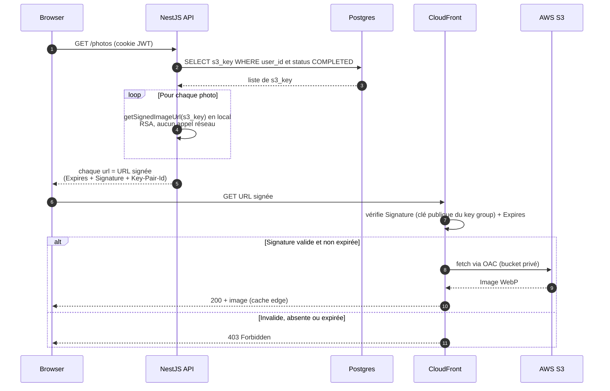

# URLs CloudFront signées — Note de soutenance

> Complète [pipeline-upload-photos.md](./pipeline-upload-photos.md). Ce document décrit comment les images
> optimisées sont passées d'un accès **public permanent** à un accès **privé via URL signée à durée limitée**.

## 1. Contexte et besoin

À l'issue du pipeline d'upload, chaque photo optimisée est servie par CloudFront à une URL du type :

```
https://<domaine>.cloudfront.net/optimized/<uuid>.webp
```

Dans la première version, cette URL était **non signée et permanente**, et elle était **stockée en base**
(colonne `photos.cloudfront_url`, posée par le worker). Conséquences :

- N'importe qui possédant l'URL pouvait voir l'image, **à vie** (pas d'expiration).
- La seule « protection » était l'imprévisibilité de l'UUID → sécurité par l'obscurité, pas une vraie
  confidentialité. Une URL qui leake (historique, logs, lien copié) = fuite permanente.

Le besoin : **les images sont privées par défaut**, seul un accès explicitement autorisé et **temporaire** doit
pouvoir les afficher. C'est aussi le pré-requis technique du futur **partage par lien révocable**.

## 2. Le concept : signature asymétrique CloudFront

### 2.1 Principe

Une URL signée CloudFront, c'est la même URL à laquelle on accroche une **preuve cryptographique** :

```
https://<domaine>.cloudfront.net/optimized/<uuid>.webp
  ?Expires=1779879600          ← date d'expiration (epoch)
  &Key-Pair-Id=K...            ← quelle clé publique CloudFront doit vérifier
  &Signature=lveLeH...==        ← la signature RSA-SHA1 (canned policy)
```

Le schéma repose sur une **paire de clés RSA** (asymétrique) :

1. L'**API** détient la **clé privée** (secret).
2. Quand l'API répond une URL d'image, elle fabrique une « police » (`{ url, dateLessThan }`) et la **signe**
   avec la clé privée.
3. **CloudFront** détient la **clé publique** correspondante (enregistrée dans un *key group*). À chaque requête
   il vérifie la signature et la date. Valide + non expirée → 200. Sinon → **403**.

Propriétés : **expiration** (TTL court), **infalsifiable** (sans la clé privée, pas de signature valide ; changer
un caractère de l'URL ou de la date invalide tout), et **vérification au niveau du CDN** (pas seulement dans le
code applicatif).

### 2.2 Différence avec les presigned URLs de l'upload

Le projet utilise déjà des signatures **côté S3** pour l'upload (cf. note pipeline §3) — ne pas confondre :

| | Presigned S3 (upload) | Signed URL CloudFront (lecture) |
|---|---|---|
| Crypto | HMAC-SHA256 (**symétrique**, dérivée de `AWS_SECRET_ACCESS_KEY`) | RSA-SHA1 (**asymétrique**, clé privée/publique dédiée) |
| Qui vérifie | S3 | CloudFront |
| Opération | `PUT` d'une part précise | `GET` d'un objet via le CDN |
| Package | `@aws-sdk/s3-request-presigner` | `@aws-sdk/cloudfront-signer` |

### 2.3 Analogie

URL non signée = une maison sans serrure à une adresse compliquée. URL signée = un **badge d'accès à durée
limitée** que seule l'API peut émettre, et qu'un videur (CloudFront) vérifie à l'entrée.

## 3. Architecture retenue

### 3.1 Décision clé : signer à la lecture, ne plus stocker l'URL

Une URL signée **expire** → la stocker en base n'a plus de sens (elle deviendrait périmée). On stocke donc
uniquement la **`s3_key`** et on **génère l'URL signée à la volée** dans chaque réponse d'API.



### 3.2 En une phrase

L'API ne publie plus d'URL permanente : à chaque lecture elle **signe localement** une URL valable quelques
heures, et CloudFront **refuse (403)** toute requête sans signature valide → les images sont réellement privées.

## 4. Le code — fichiers concernés

### 4.1 `AwsService` — la signature

Fichier : [apps/api/src/aws/aws.service.ts](../../apps/api/src/aws/aws.service.ts)

#### a) L'import du signer

```ts
import { getSignedUrl as getCloudFrontSignedUrl } from '@aws-sdk/cloudfront-signer';
```

On **alias** l'import car le service importe déjà `getSignedUrl` depuis `@aws-sdk/s3-request-presigner` (pour
l'upload). Deux fonctions homonymes, deux usages : `getSignedUrl` (S3, HMAC) pour l'upload,
`getCloudFrontSignedUrl` (RSA) pour la lecture.

#### b) Les champs et le constructeur

Le service garde 3 nouveaux champs privés, remplis **une seule fois au boot** :

```ts
private cloudFrontKeyPairId: string;
private cloudFrontPrivateKey: string;
private signedUrlTtl: number;

constructor(private config: ConfigService) {
  // ...
  this.cloudFrontKeyPairId = this.config.getOrThrow<string>('CLOUDFRONT_KEY_PAIR_ID');
  this.cloudFrontPrivateKey = Buffer.from(
    this.config.getOrThrow<string>('CLOUDFRONT_PRIVATE_KEY_BASE64'),
    'base64',
  ).toString('utf8');
  this.signedUrlTtl = parseInt(
    this.config.get<string>('CLOUDFRONT_SIGNED_URL_TTL_SECONDS') ?? '3600',
    10,
  );
  // ...
}
```

Points importants :

- **`getOrThrow`** : si `CLOUDFRONT_KEY_PAIR_ID` ou `CLOUDFRONT_PRIVATE_KEY_BASE64` manque, l'app **crashe au
  démarrage** (pas à la première signature en runtime). On préfère un échec immédiat et visible.
- **Décodage base64 → PEM** : la clé privée est stockée en base64 dans le `.env`
  (`Buffer.from(..., 'base64').toString('utf8')`). Pourquoi ? Un PEM est multi-ligne (`-----BEGIN…`, lignes de
  64 caractères, `-----END…`) → ingérable tel quel dans un `.env`/Docker/CI. Le base64 le réduit à **une seule
  ligne** sans caractère spécial. On le re-décode ici pour récupérer le PEM brut attendu par le signer.
- **TTL** : `get` (pas `getOrThrow`) + `?? '3600'` → la variable est **optionnelle**, défaut 1 h.

#### c) La méthode `getSignedImageUrl`

```ts
getSignedImageUrl(key: string, ttlSeconds: number = this.signedUrlTtl): string {
  const ttlMs = ttlSeconds * 1000;
  // Arrondit l'expiration à une fenêtre fixe : toutes les requêtes d'une même fenêtre
  // produisent une URL IDENTIQUE -> cacheable (navigateur / CDN / next-image).
  const windowIndex = Math.floor(Date.now() / ttlMs);
  const dateLessThan = new Date((windowIndex + 2) * ttlMs).toISOString();
  return getCloudFrontSignedUrl({
    url: `https://${this.cloudFrontDomain}/${key}`,
    keyPairId: this.cloudFrontKeyPairId,
    privateKey: this.cloudFrontPrivateKey,
    dateLessThan,
  });
}
```

Ligne par ligne :

1. `key` est la `s3_key` de la photo (ex. `optimized/uuid.webp`) ; `ttlSeconds` est paramétrable mais vaut le
   TTL de config par défaut.
2. `windowIndex = floor(now / ttlMs)` : on découpe le temps en **fenêtres** de `ttlMs`. Toutes les requêtes
   tombant dans la même fenêtre obtiennent le **même** `windowIndex`.
3. `dateLessThan = (windowIndex + 2) * ttlMs` : l'instant d'expiration, **identique** pour toute la fenêtre.
   `toISOString()` car le signer attend une date.
4. `getCloudFrontSignedUrl({ url, keyPairId, privateKey, dateLessThan })` : c'est le package AWS qui fait le
   travail (cf. § d). On lui passe l'URL de base, l'ID de la clé publique CloudFront, la clé privée PEM et la date.

> L'ancienne méthode `getPublicUrl()` (qui renvoyait `https://${domain}/${key}` en clair) est **supprimée** :
> plus aucun appelant ne doit produire d'URL non signée.

#### d) Ce que fait `getCloudFrontSignedUrl` sous le capot (canned policy)

Le package `@aws-sdk/cloudfront-signer` :

1. Construit une **policy « canned »** (forme figée) : `{"Statement":[{"Resource":"<url>","Condition":{"DateLessThan":{"AWS:EpochTime":<expires>}}}]}`.
2. Calcule la **signature RSA-SHA1** de cette policy avec la clé privée.
3. Encode la signature en **base64 « URL-safe »** (CloudFront remplace `+/=` par `-~_`).
4. Renvoie l'URL d'origine + 3 query params : `Expires` (l'epoch), `Signature` (la signature), `Key-Pair-Id`
   (quelle clé publique CloudFront doit utiliser pour vérifier).

CloudFront, à la réception, refait l'opération inverse avec la **clé publique** du key group : si la signature
correspond et que `Expires` n'est pas dépassé → il sert l'objet, sinon **403**.

#### e) Pourquoi arrondir le TTL ?

Si on signait avec `Date.now() + ttl` à chaque appel, **chaque réponse produirait une URL différente** (le
`Expires` et donc la `Signature` changent à la milliseconde) → le cache (navigateur, CDN, `next/image`) raterait
systématiquement, et on re-signerait à chaque requête. En arrondissant à une fenêtre, l'URL est **stable** pendant
toute la fenêtre → cacheable. Le `+2` garantit une validité comprise entre **1× et 2× le TTL** (sans l'offset, une
requête en fin de fenêtre recevrait une URL quasi expirée).

### 4.2 `PhotoService` — signe à la lecture

Fichier : [apps/api/src/photo/photo.service.ts](../../apps/api/src/photo/photo.service.ts)

Le service injecte déjà `AwsService`. Les 3 endpoints de lecture remplacent la lecture du champ stocké
`photo.cloudFrontUrl` par un appel à `this.aws.getSignedImageUrl(photo.s3Key)`. C'est le **seul** changement : la
requête DB, la pagination, le filtrage par `userId` ne bougent pas.

**`listForUser` (galerie paginée) :**

```ts
// AVANT : url: photo.cloudFrontUrl,
items: photos.map((photo) => ({
  id: photo.id,
  url: this.aws.getSignedImageUrl(photo.s3Key),  // signée à la volée
  originalName: photo.originalName,
  createdAt: photo.createdAt,
})),
```

**`listByCell` (exploration chromatique) :** même substitution dans le `map` des photos de la cellule
sélectionnée (la signature est en réalité centralisée dans `toPhotoResponse`, réutilisé par la galerie
et l'exploration).

```ts
items: photos.map((photo) => ({
  id: photo.id,
  url: this.aws.getSignedImageUrl(photo.s3Key),  // signée à la lecture
  originalName: photo.originalName,
  createdAt: photo.createdAt,
  shareToken: photo.shareToken,
})),
```

**`getStatus` (polling pendant l'upload) :** on ne signe que si la photo est prête, sinon `null`.

```ts
return {
  id: photo.id,
  status: photo.status,
  url: photo.status === PhotoStatus.COMPLETED
    ? this.aws.getSignedImageUrl(photo.s3Key)
    : null,
};
```

> Comme la signature est purement locale (calcul RSA, ~µs, pas d'appel réseau), signer N photos dans un `map`
> reste négligeable même pour une page de galerie.

### 4.3 `PhotoProcessor` — ne stocke plus l'URL

Fichier : [apps/api/src/photo/photo.processor.ts](../../apps/api/src/photo/photo.processor.ts)

L'`update` final ne pose plus `cloudFrontUrl`. Il conserve `status`, `s3Key` (= clé optimisée), `fileSizeBytes`,
`dominantColor`. La signature se fait désormais à partir de `s3Key` au moment de la lecture.

### 4.4 Entité + migration

Fichiers : [apps/api/src/photo/entities/photo.entity.ts](../../apps/api/src/photo/entities/photo.entity.ts) +
migration `…-Migration.ts`

- La colonne `cloudFrontUrl` (`cloudfront_url`) est retirée de l'entité.
- Migration générée via `bun run migration:generate` puis appliquée via `bun run migration:run` :

```ts
public async up(qr: QueryRunner) { await qr.query(`ALTER TABLE "photos" DROP COLUMN "cloudfront_url"`); }
public async down(qr: QueryRunner) { await qr.query(`ALTER TABLE "photos" ADD "cloudfront_url" text`); }
```

> En dev, le schéma est géré **uniquement par migrations** (`synchronize: false` codé en dur dans
> [database.config.ts](../../apps/api/src/config/database.config.ts)). En prod, le job `migrate` du workflow
> [.github/workflows/api.yml](../../.github/workflows/api.yml) lance `migration:run` après le déploiement.

### 4.5 Variables d'environnement

Fichier : `apps/api/.env` (local, gitignoré) + secret GitHub **`ENV_PROD`** (prod) :

| Variable | Rôle |
|---|---|
| `CLOUDFRONT_KEY_PAIR_ID` | ID de la clé publique enregistrée dans CloudFront (format `K…`) |
| `CLOUDFRONT_PRIVATE_KEY_BASE64` | Clé privée PEM encodée base64 (`base64 -w0 private_key.pem`) — évite les soucis de multi-ligne en `.env`/Docker/CI |
| `CLOUDFRONT_SIGNED_URL_TTL_SECONDS` | Durée de validité (défaut 3600) |

Dépendance ajoutée : `@aws-sdk/cloudfront-signer` ([apps/api/package.json](../../apps/api/package.json)).

## 5. Configuration infra AWS

La signature côté code ne protège **rien** tant que l'infra n'est pas verrouillée. Étapes (console CloudFront + S3) :

1. **Paire de clés RSA** : `openssl genrsa -out private_key.pem 2048` puis
   `openssl rsa -pubout -in private_key.pem -out public_key.pem`.
2. **CloudFront → Public keys** : importer `public_key.pem` → récupérer l'ID `K…` → `CLOUDFRONT_KEY_PAIR_ID`.
3. **CloudFront → Key groups** : créer un key group contenant cette clé publique.
4. **S3 verrouillé** : *Block all public access* = ON + bucket policy autorisant **uniquement**
   `cloudfront.amazonaws.com` via OAC, avec condition sur l'ARN de la distribution :

```json
{
  "Effect": "Allow",
  "Principal": { "Service": "cloudfront.amazonaws.com" },
  "Action": "s3:GetObject",
  "Resource": "arn:aws:s3:::fil-rouge-bucket-s3/*",
  "Condition": { "ArnLike": { "AWS:SourceArn": "arn:aws:cloudfront::<account-id>:distribution/<distribution-id>" } }
}
```

5. **CloudFront → Behaviors → behavior `/optimized/*` (ou `Default (*)`) → Restrict viewer access = Yes →
   Trusted key groups** : sélectionner le key group. **C'est cette étape qui active l'enforcement** : toute URL
   non signée → 403.

### Ordre de bascule (éviter une coupure d'images)

1. Créer clé publique + key group **sans** activer l'enforcement.
2. Renseigner les 3 variables et **déployer le code** de signature (les URLs non signées marchent encore).
3. **Puis seulement** activer le Trusted key group (étape 5) → l'enforcement prend effet, tout est déjà signé.

> Tant que l'enforcement n'est pas activé, CloudFront ignore les query params : les images s'affichent même si
> `CLOUDFRONT_KEY_PAIR_ID` est encore vide. Le basculement est donc sans risque si l'ordre est respecté.

## 6. Sécurité & vérification

Test concret réalisé après activation (objet réel `optimized/<uuid>.webp`) :

| URL | Avant enforcement | Après enforcement |
|---|---|---|
| Non signée (`/optimized/uuid.webp`) | 200 | **403** ✅ |
| Signée (`?Expires&Signature&Key-Pair-Id`) | 200 | **200** ✅ |
| Accès direct S3 (hors CloudFront) | 403 | **403** ✅ |

Le 403 sur la non signée prouve que l'enforcement est actif ; le 200 sur la signée prouve que la clé privée de
l'API correspond bien à la clé publique enregistrée dans CloudFront.

**Plan de secours** : si la signée renvoie aussi 403, c'est un mismatch clé publique/ID → détacher le Trusted key
group (Restrict viewer access = No) rétablit immédiatement le service, le temps de revérifier la clé.

**Gestion des secrets** : la clé privée vit en base64 dans `.env` (gitignoré, lu par le runtime) ; les `.pem`
locaux sont dans `apps/api/.cloudfront-keys/` (gitignoré, `*.pem` aussi). Le runtime ne lit **que** le `.env` →
les fichiers `.pem` peuvent être archivés hors repo une fois la clé publique enregistrée.

## 7. Trade-offs assumés

| Choix | Trade-off | Justification |
|---|---|---|
| Signer à la lecture (pas de stockage) | Un peu de CPU par réponse (RSA local, ~µs) | Une URL stockée expirerait ; signer à la volée est la seule option correcte |
| TTL arrondi à une fenêtre | Validité variable (1×–2× TTL) | Rend les URLs cacheables (sinon cache toujours raté) |
| RSA-SHA1 (canned policy) | Algo daté imposé par CloudFront | Standard CloudFront ; suffisant car la sécurité tient à la clé privée, pas à SHA1 |
| Même clé dev/prod possible | Moins d'isolation | Recommandé : une paire dédiée par environnement (à faire pour la prod) |

## 8. Questions probables du jury + réponses

**Q : Quelle différence entre les signatures de l'upload et de la lecture ?**
R : Upload = presigned S3, HMAC-SHA256 **symétrique** (clé dérivée du secret AWS), vérifiée par S3. Lecture =
signed URL CloudFront, RSA **asymétrique** (clé privée API / clé publique CloudFront), vérifiée par le CDN.

**Q : Pourquoi ne plus stocker l'URL en base ?**
R : Une URL signée expire. Stockée, elle deviendrait invalide. On stocke la `s3_key` et on signe à la volée à
chaque réponse, avec un TTL arrondi pour rester cacheable.

**Q : Que se passe-t-il si quelqu'un récupère une URL signée ?**
R : Il peut voir l'image **jusqu'à l'expiration** (quelques heures), puis l'URL renvoie 403. C'est le
comportement voulu pour le partage. Pour révoquer avant expiration, il faudrait rotationner la clé (ou, pour le
futur partage, invalider le token applicatif).

**Q : Et si on ne verrouille pas S3 ?**
R : La signature ne sert à rien : l'objet resterait accessible en direct sur S3. D'où *Block public access* + OAC
+ condition `SourceArn` sur la bucket policy. L'accès direct S3 renvoie 403.

**Q : Comment éviter une coupure d'images au déploiement ?**
R : Déployer le code de signature **avant** d'activer le Trusted key group. Tant qu'il n'est pas activé,
CloudFront sert les images en ignorant les query params.

## Annexe — Fichiers clés

- [apps/api/src/aws/aws.service.ts](../../apps/api/src/aws/aws.service.ts) — `getSignedImageUrl` (signature RSA CloudFront)
- [apps/api/src/photo/photo.service.ts](../../apps/api/src/photo/photo.service.ts) — signature à la lecture (list/colors/status)
- [apps/api/src/photo/photo.processor.ts](../../apps/api/src/photo/photo.processor.ts) — ne stocke plus l'URL
- [apps/api/src/photo/entities/photo.entity.ts](../../apps/api/src/photo/entities/photo.entity.ts) — colonne `cloudfront_url` retirée
- [apps/api/src/config/database.config.ts](../../apps/api/src/config/database.config.ts) — `synchronize: false`, schéma géré par migrations
- [packages/shared/src/schemas/photos.schema.ts](../../packages/shared/src/schemas/photos.schema.ts) — `url: z.url()` (inchangé, accepte les query params signés)
