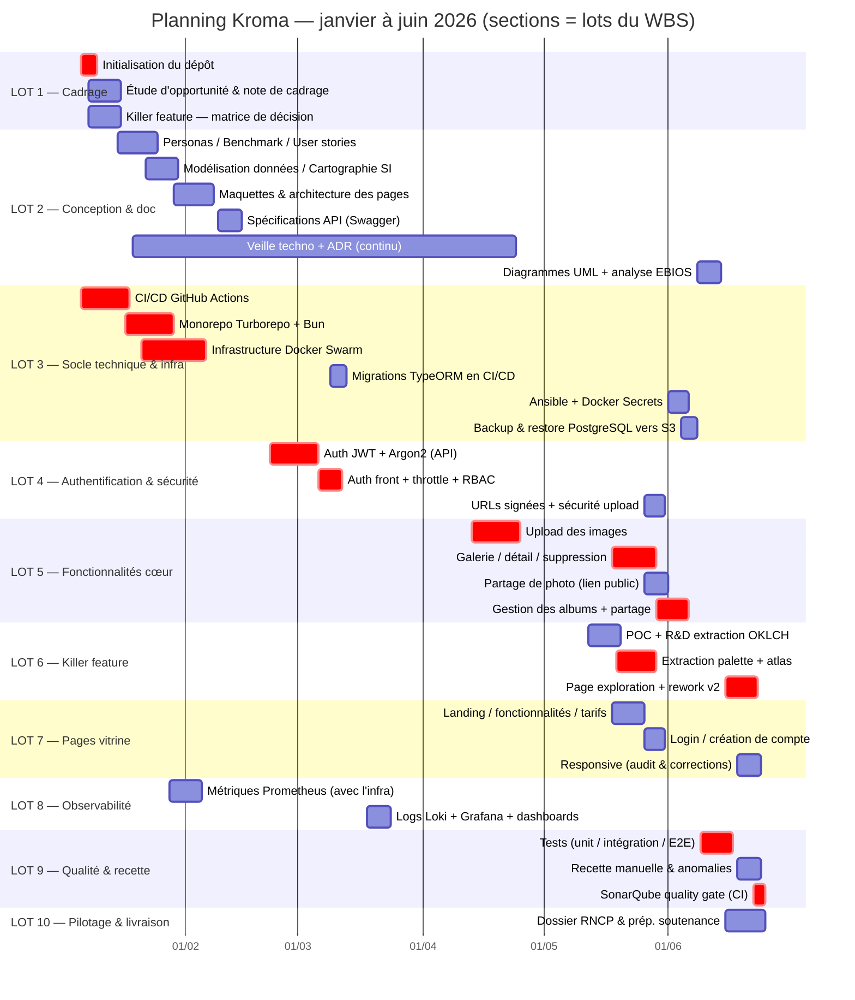

# WBS & Planning (Gantt) — Plateforme de gestion de photos

**Projet :** Fil Rouge — Plateforme de gestion de photos et albums (« Kroma »)
**Auteur :** Tony Mascate
**Date :** Juin 2026
**Version :** 1.0

> Ce document découpe le projet en lots de travail (**WBS**) puis les positionne
> dans le temps (**Gantt**). La fenêtre calendaire (5 janvier → 24 juin 2026) est
> ancrée sur l'historique Git réel du dépôt et le backlog (Trello) ; le
> séquencement est présenté en **vue de planification** (cf. §3). Règle WBS
> appliquée : **chaque feuille est une tâche estimable et assignable.**

---

## 1. WBS — Organigramme des tâches

```
Projet Kroma
│
├── LOT 1 — Cadrage & avant-projet
│   ├── 1.1 Initialisation du dépôt (monorepo, conventions)
│   ├── 1.2 Étude d'opportunité (Go/No-Go)
│   ├── 1.3 Note de cadrage
│   └── 1.4 Killer feature — propositions & matrice de décision
│
├── LOT 2 — Conception & documentation
│   ├── 2.1 Personas
│   ├── 2.2 Benchmark concurrentiel
│   ├── 2.3 User stories
│   ├── 2.4 Dossier de veille technologique
│   ├── 2.5 Cartographie SI
│   ├── 2.6 Modélisation des données (MCD / MLD / MPD)
│   ├── 2.7 ADR (Architecture Decision Records)
│   ├── 2.8 Diagrammes UML (cas d'utilisation)
│   ├── 2.9 Maquettes & architecture des pages
│   ├── 2.10 Spécifications API (Swagger)
│   └── 2.11 Analyse des risques (EBIOS)
│
├── LOT 3 — Socle technique & infrastructure (DevOps)
│   ├── 3.1 Monorepo Turborepo + Bun
│   ├── 3.2 Infrastructure Docker Swarm
│   ├── 3.3 CI/CD GitHub Actions (build / deploy)
│   ├── 3.4 Migrations TypeORM intégrées au CI/CD
│   ├── 3.5 Infrastructure as Code (Ansible)
│   ├── 3.6 Docker Secrets
│   ├── 3.7 Déploiement de la stack via CI/CD (vs VPS manuel)
│   └── 3.8 Backup & restore PostgreSQL vers S3
│
├── LOT 4 — Authentification & sécurité
│   ├── 4.1 Auth JWT + Argon2 (API)
│   ├── 4.2 Auth front + middleware
│   ├── 4.3 Rate limiting (NestJS Throttler)
│   ├── 4.4 RBAC / rôles (récupération en base)
│   ├── 4.5 Sécurité de l'upload (quota, validation fichiers)
│   ├── 4.6 URLs signées CloudFront
│   └── 4.7 Protection CSRF
│
├── LOT 5 — Fonctionnalités cœur
│   ├── 5.1 Upload des images (API + front)
│   ├── 5.2 Galerie chronologique
│   ├── 5.3 Détail & suppression d'une photo
│   ├── 5.4 Partage de photo (lien public)
│   ├── 5.5 Gestion des albums
│   └── 5.6 Partage d'album (entre utilisateurs)
│
├── LOT 6 — Killer feature : Exploration Chromatique
│   ├── 6.1 R&D extraction couleur (POC OKLCH ; piste gRPC étudiée puis écartée)
│   ├── 6.2 Extraction de palette OKLCH à l'upload
│   ├── 6.3 Atlas / nuancier fixe (53 cellules)
│   ├── 6.4 Page d'exploration (front + back)
│   └── 6.5 Rework v2 (atlas OKLCH, intégration thème app)
│
├── LOT 7 — Pages vitrine (Frontend)
│   ├── 7.1 Landing page
│   ├── 7.2 Page des fonctionnalités
│   ├── 7.3 Page de tarification
│   ├── 7.4 Pages login / création de compte
│   └── 7.5 Responsive (audit & corrections)
│
├── LOT 8 — Observabilité
│   ├── 8.1 Métriques Prometheus (mises en place avec Docker Swarm / réplicas)
│   ├── 8.2 Logs Loki + pino
│   └── 8.3 Dashboards Grafana
│
├── LOT 9 — Qualité & recette
│   ├── 9.1 Tests unitaires (API)
│   ├── 9.2 Tests d'intégration (testcontainers)
│   ├── 9.3 Tests E2E (Supertest API / Playwright web)
│   ├── 9.4 Tests web (Vitest)
│   ├── 9.5 SonarQube + linter (quality gate bloquant en CI)
│   └── 9.6 Recette manuelle & reprise d'anomalies
│
└── LOT 10 — Pilotage & livraison
    ├── 10.1 Documents de pilotage (WBS, Gantt, RACI, budget)
    ├── 10.2 Dossier professionnel RNCP
    └── 10.3 Préparation soutenance (COPIL simulé)
```

---

## 2. Estimation de charge par lot

Estimation en **jours·homme (j·h)**, au TJM de référence du [budget](budget-estimatif.md).
Le total (~74 j·h) constitue la **base de chiffrage du budget**, réparti en
~48 j de développement technique (lots 3 à 8), ~21 j de conception & documentation
(lots 1, 2, 10) et ~5 j de recette & qualité (lot 9).

### 2.1 Charge théorique vs effort réel

Il faut distinguer **trois grandeurs** que le jury ne doit pas confondre :

| Grandeur                                          |                Valeur                 | Nature                                             |
| ------------------------------------------------- | :-----------------------------------: | -------------------------------------------------- |
| **Durée calendaire**                              | ~24 semaines (05 janv → 24 juin 2026) | Temps écoulé, à temps partiel                      |
| **Charge théorique** (estimation pro, ci-dessous) |               ≈ 74 j·h                | Base de chiffrage du [budget](budget-estimatif.md) |
| **Effort réel cumulé**                            |               ≈ 56 j·h                | Reconstruit depuis le rythme de travail effectif   |

**Reconstruction de l'effort réel :** le projet n'a pas été mené à temps plein.

- **8 semaines de cours** travaillées en intensif (≈ 5 j) → **≈ 40 j·h**
- **16 semaines restantes** à ≈ 1 j/semaine → **≈ 16 j·h**
- **Total ≈ 56 j·h** réparti sur ~6 mois calendaires

L'effort réel (~56 j·h) est **inférieur** à l'estimation pro (~74 j·h) : un
chiffrage « conditions professionnelles » intègre une marge de coordination
d'équipe et de montée en compétence qu'un **développeur solo, seul concepteur de
son architecture**, n'a pas à supporter. L'écart (~25 %) est donc cohérent et
attendu.

| Lot | Intitulé                         | Charge estimée |
| --- | -------------------------------- | :------------: |
| 1   | Cadrage & avant-projet           |      3 j       |
| 2   | Conception & documentation       |      12 j      |
| 3   | Socle technique & infrastructure |      14 j      |
| 4   | Authentification & sécurité      |      8 j       |
| 5   | Fonctionnalités cœur             |      10 j      |
| 6   | Killer feature                   |      8 j       |
| 7   | Pages vitrine                    |      5 j       |
| 8   | Observabilité                    |      3 j       |
| 9   | Qualité & recette                |      5 j       |
| 10  | Pilotage & livraison             |      6 j       |
|     | **TOTAL**                        |  **≈ 74 j·h**  |

---

## 3. Planning (diagramme de Gantt)



---

## 4. Chemin critique

Le **chemin critique** est la plus longue chaîne de tâches dépendantes : tout
retard sur l'une d'elles décale la livraison finale. Pour Kroma :

> **Init dépôt → CI/CD → Monorepo & Docker Swarm → Auth JWT → Téléversement des images
> → Galerie → Gestion des albums → Exploration Chromatique v2 → Tests → Quality gate SonarQube**

Justification : rien ne se déploie sans la chaîne **CI/CD + infrastructure Swarm** ;
aucune fonctionnalité applicative n'est accessible sans l'**authentification**. La
killer feature dépend directement du **téléversement** : c'est à l'ingestion que
chaque photo est indexée (palette OKLCH + cellules d'atlas), l'album n'étant qu'un
**filtre optionnel** — par défaut, l'exploration porte sur toute la bibliothèque. La
galerie et les albums ne sont donc pas des prérequis de la killer feature, mais font
partie du cœur applicatif que la **campagne de tests finale** doit couvrir, avant la
passerelle qualité bloquante préalable à toute livraison sur `main`.

Les tâches **hors chemin critique** (documentation, pages vitrine, observabilité,
partage) disposent d'une marge : elles ont été menées en parallèle des développements
cœur sans jamais bloquer la chaîne principale.

---

_Document rédigé dans le cadre du Fil Rouge — certification Expert en Informatique et Systèmes d'Information, 3W Academy._
